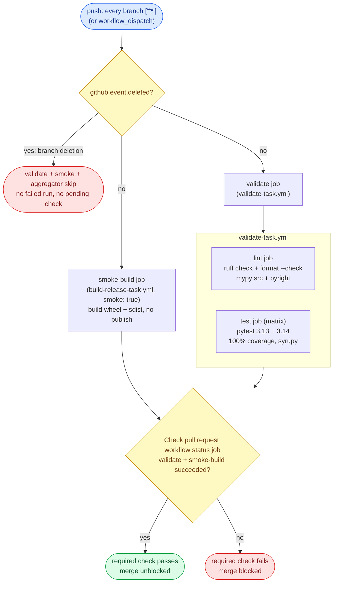
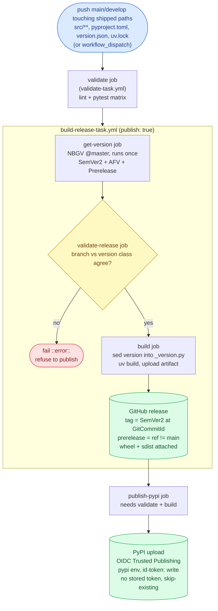
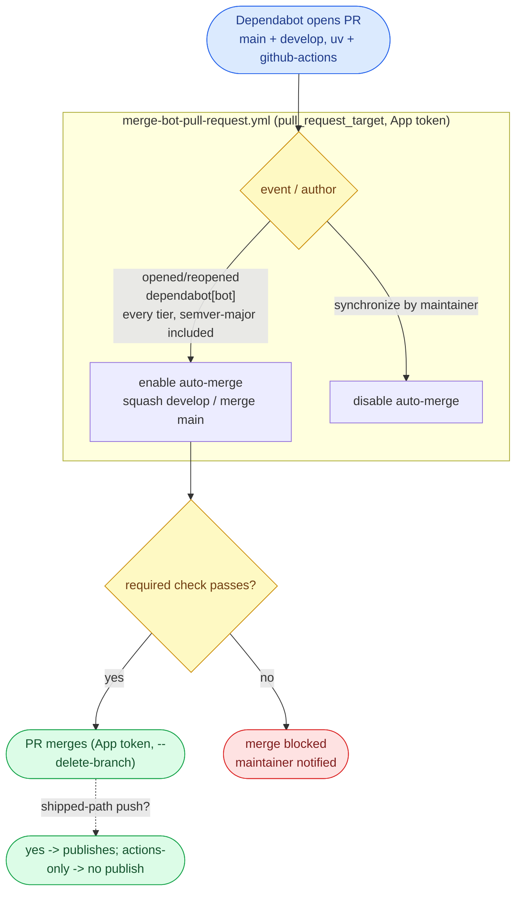

# WORKFLOW.md

The single guide for this repo's CI/CD **workflows** (GitHub Actions): the model, a **behavioral contract** (expected inputs and outputs), and how to verify it. Source style lives in [`CODESTYLE.md`](./CODESTYLE.md); human-process rules (branching, versioning policy, review etiquette) live in [`AGENTS.md`](./AGENTS.md). This file covers everything under [`.github/workflows/`](./.github/workflows/).

It **describes required outcomes, not a required implementation.** A workflow is correct when it satisfies the contract, whatever shape its YAML takes. Each guarantee names the **failure it prevents**, so the reason survives a reimplementation.

## 0. The model at a glance

aiopurpleair ships **one target**: the PyPI distribution **`aiopurpleair-ptr727`** (a wheel + sdist), built from the library source in [`src/aiopurpleair/`](./src/aiopurpleair/). PyPI is a **push** distributor - a consumer pins the package and `pip install`s it - so a fresh release should reach PyPI as soon as a shippable change lands, without a manual step for the common case. Two workflows do the work:

- **CI** ([`test-pull-request.yml`](./.github/workflows/test-pull-request.yml)) runs on **push to every branch**: it validates (lint + the 3.13/3.14 pytest matrix) and proves the wheel + sdist build (a smoke build), publishing nothing. A pull request merges only when its one required check is green.
- **The publisher** ([`publish-release.yml`](./.github/workflows/publish-release.yml)) runs on a **paths-filtered push** to `main`/`develop` and on **`workflow_dispatch`**. A push (or dispatch) on `main` cuts a **stable** release (clean PEP 440 `X.Y.Z`); on `develop` a **prerelease** (`X.Y.Z.dev0`). It re-runs the identical validate suite, builds and versions once, cuts a GitHub release, and uploads to PyPI over **OIDC Trusted Publishing** - no stored token.

There is no two-branch matrix: one run builds, versions, and publishes exactly its own trigger ref. Dependabot pull requests merge themselves once their checks pass, on both branches.

### Glossary

- **Entry workflow** - has `push` / `workflow_dispatch` triggers. The orchestrator an event or a person starts.
- **Reusable workflow (task)** - a `workflow_call` workflow invoked through a `uses:` reference, never triggered directly. File ends in `-task.yml`.
- **Target** - the one shipped output: the PyPI wheel + sdist `aiopurpleair-ptr727`, built by [`build-release-task.yml`](./.github/workflows/build-release-task.yml) and uploaded by `publish-release`'s `publish-pypi` job.
- **Validate task** - [`validate-task.yml`](./.github/workflows/validate-task.yml): the `lint` job (`ruff check`, `ruff format --check`, `mypy src`, `pyright`) plus the `test` job (the 3.13/3.14 pytest matrix, 100% coverage, syrupy snapshots, best-effort Codecov upload). CI runs it on every push; the publisher runs the **identical** task before any release.
- **Smoke build** - a `build-release-task` run with `smoke: true`/`publish: false` that builds the wheel + sdist to prove the release pipeline still produces a valid package, uploading and publishing nothing. Its `validate-release` version gate is skipped on smoke.
- **Shipped path** - the paths-filter inclusion list on the publisher's push trigger: `src/aiopurpleair/**`, `pyproject.toml`, `version.json`, `uv.lock`. A push touching one of these to `main`/`develop` publishes; a docs/test/workflow-only push does not.
- **Shipped version** - NBGV's version, computed from `version.json` (CalVer base `2026.8`) plus git height. `main` is the public ref (clean `X.Y.Z`); every other branch carries NBGV's `-g{sha}` prerelease segment. The PEP 440 package version is derived from it (`develop` -> `.dev0`) and `sed`-stamped into `_version.py` at build.
- **GitHub App token** - a short-lived installation token from `actions/create-github-app-token`, minted from `CODEGEN_APP_CLIENT_ID` / `CODEGEN_APP_PRIVATE_KEY`. The merge-bot uses it, not `GITHUB_TOKEN`: a `GITHUB_TOKEN` merge does not trigger the downstream publish push, and that token is read-only on Dependabot PRs.

## 1. Workflow style conventions

Legibility rules. Necessary but not sufficient: a perfectly styled workflow can still violate section 3.

- **Action pinning.** Pin every action to a commit SHA with a trailing `# vX.Y.Z` comment. The **sole exception is `dotnet/nbgv@master`** (see D6.1): its tag stream lags `master`, so Dependabot tag-tracking would only propose downgrades. The rationale is documented inline in [`get-version-task.yml`](./.github/workflows/get-version-task.yml).
- **Filename.** Reusable workflows end in `-task.yml` and are `uses:`-d, never triggered directly; entry workflows end in what they do (`-pull-request.yml`, `-release.yml`).
- **Names.** Reusable workflow `name:` ends in **"task"**, entry names in **"action"**. Every job `name:` ends in **"job"**, every step `name:` in **"step"** - the aggregator included (`Check pull request workflow status job`). A job name bound as a ruleset required-check `context:` is codified in [`repo-config/`](./repo-config/) and changed only **in lockstep** with the live ruleset.
- **Concurrency.** CI keys on `${{ github.workflow }}-${{ github.ref }}` with `cancel-in-progress: true`. The **publisher** overrides it: a ref-independent group (`group: ${{ github.workflow }}`) with `cancel-in-progress: false`, so a stable and a prerelease publish serialize and none is cancelled mid-release (which could leave a half-created GitHub release or a partial PyPI upload). The **merge-bot** keys on the PR number with `cancel-in-progress: false`.
- **Shells.** Every multi-line bash `run:` starts with `set -euo pipefail`. Multi-line `if:` uses the folded scalar `if: >-`.
- **Boolean inputs.** A boolean used by both `workflow_call` and `workflow_dispatch` is declared in both trigger blocks and compared against `true` and `'true'`.
- **Reusable-workflow permissions.** Job-level `permissions:` are validated before `if:`, so grant least privilege at the callee and let the caller add scope (e.g. `contents: write` for the GitHub release) at the `uses:` job - the read-only smoke caller must not be forced to over-grant.

## 2. Architecture

### Two workflows: CI on push, publishing on push-plus-dispatch

CI ([`test-pull-request.yml`](./.github/workflows/test-pull-request.yml)) and the publisher ([`publish-release.yml`](./.github/workflows/publish-release.yml)) are separate workflows with separate concurrency, so they never race. CI re-tests every pushed tree and never publishes; the publisher releases on a shipped-path push (or a dispatch) to a release branch. *Prevents a CI run from racing a publish on the same ref.*

### The publisher is scoped by branch and by path

A publish happens on a `push` to `main`/`develop` filtered to the shipped paths (`src/aiopurpleair/**`, `pyproject.toml`, `version.json`, `uv.lock`), or on a `workflow_dispatch`. The trigger ref alone decides the version class: `main` -> stable clean SemVer, `develop` -> `.dev0` prerelease. The paths filter is deliberate - a docs, test, or workflow-only push to a release branch does not consume a version. `uv.lock` is in the list because a PyPI version cannot be re-pushed, so a dependency bump must republish to keep the package's declared dependencies current, closing the stale-dependency window. *Prevents both a no-op republish on a docs change and a silently stale dependency set after a lock bump.*

### Validate is one definition, run by both entry points

[`validate-task.yml`](./.github/workflows/validate-task.yml) is the whole quality gate: a `lint` job (`ruff check` + `ruff format --check` + `mypy src` + `pyright`) and a `test` job (the 3.13/3.14 pytest matrix with a 100% coverage gate and syrupy snapshots). CI's `validate` job and the publisher's `validate` job both `uses:` it, and `publish-pypi` `needs:` the publisher's copy. *Keeps the PR gate and the publish gate identical, so nothing publishes that would fail a pull request.*

### Versioning: compute once, thread everywhere

NBGV runs in exactly **one** job ([`get-version-task.yml`](./.github/workflows/get-version-task.yml)), classifying from the checked-out branch (with `IGNORE_GITHUB_REF: "true"` so a dispatch from the default branch does not misclassify), and emits `SemVer2`, `AssemblyFileVersion`, `GitCommitId`, and a derived `Prerelease` flag. `build-release-task` calls it once and every consumer (the version gate, the build, the release) reads its outputs via `needs:`; no job re-invokes NBGV. `main` (the public ref, `publicReleaseRefSpec = ^refs/heads/main$`) builds a clean `X.Y.Z`; every other branch a prerelease. *Keeps the stamped `_version.py`, the wheel version, and the release tag in agreement.* NBGV needs only `version.json` (base `2026.8`) and git height, so it works although the repo builds no .NET assembly.

### Build: gate the classification, stamp the version, build the package

[`build-release-task.yml`](./.github/workflows/build-release-task.yml) versions once, then in `validate-release` asserts the branch and version class agree before any build (`main` must have no prerelease `-` segment; every other branch must carry one) - a fail-fast on a misclassification, skipped on smoke. The `build` job checks out the exact `GitCommitId`, computes the PEP 440 version (`develop` -> `M.N.P.B.dev0`, else `M.N.P.B`), `sed`s it into `_version.py` (the placeholder hatchling reads; the rewrite is on the runner only, no commit), and runs `uv build`. On a real publish it uploads the wheel + sdist as a run artifact for `publish-pypi`; the `github-release` job (gated `inputs.publish && !inputs.smoke`) cuts the GitHub release.

### Self-testing workflows, and the required-context invariant

A pull request exercises its own workflow files. CI runs on `push` to every branch (`push: ['**']`), so GitHub head-resolves the reusable `./...` workflows from the pushed head: a PR that edits a reusable task tests its own copy. That push run is the **sole producer** of the aggregator's ruleset-bound `context:`, on the head SHA branch protection evaluates. A branch-deletion push (all-zeros `github.sha`) is skipped by a `!github.event.deleted` guard on both jobs, so a deletion never runs a failing build or leaves the required check pending. **Forks are the documented exception**: a fork cannot push here, so its PR produces no run and a maintainer lands the change on an in-repo branch before merging. There is deliberately **no `pull_request` trigger** - it would create a second producer of the required context.

### The single required check

One aggregator job, `Check pull request workflow status job`, is the ruleset-bound required check and gates the merge. It `needs:` both `validate` and `smoke-build` and fails on any non-success (it must **succeed**, not merely "not fail"). Its name must move only in lockstep with [`repo-config/`](./repo-config/).

### The single-target release

`github-release` (in `build-release-task`, `publish: true`) downloads the build artifact and `softprops/action-gh-release` creates the tag + release with auto-generated notes, attaching the wheel + sdist plus `LICENSE` and `README.md` (`fail_on_unmatched_files: true`). `target_commitish` is set explicitly to the built `GitCommitId` so the tag lands on the built commit, not the API's default branch. The GitHub-release `prerelease` boolean is `github.ref_name != 'main'`. Then `publish-pypi` uploads the same artifact to PyPI over OIDC Trusted Publishing in the `pypi` environment (`id-token: write`, `skip-existing: true`) - no stored key.

### Self-sufficiency: Dependabot on both branches

Dependabot pull requests merge themselves once the required check passes - **every tier, semver-major included**: the required check is the gate, not the version bump. Dependabot is **dual-target** (`main` **and** `develop`) so both branches stay current and never drift apart; a `develop` bump lands as a `.dev0` prerelease republish, a `main` bump as a stable republish (a `uv.lock` bump hits a shipped path, so it publishes; an actions-only bump does not). The [merge-bot](./.github/workflows/merge-bot-pull-request.yml) enables auto-merge on `opened`/`reopened` (squash on `develop`, merge-commit on `main`, by the PR's base ref) and disables it when a maintainer pushes to a bot branch.

### Flow diagrams

Three diagrams trace the architecture above: the pull-request gate, the publisher, and the bot automation. They depict the same outcomes the section 3 contract specifies, drawn from the workflow YAML; if a diagram and a guarantee disagree, one of them is a defect. Triggers are blue, gates yellow, durable/published outputs green, and stop/skip outcomes red.

**Pull request (CI) - `test-pull-request.yml`.** Every push head-resolves the reusable validate task (lint + the 3.13/3.14 pytest matrix) and a smoke build, and a single aggregator produces the ruleset-bound required check (D1, D5).

**Publish - `publish-release.yml` -> `build-release-task.yml`.** A shipped-path push to `main`/`develop`, or a dispatch, runs the same validate suite, versions once, cuts the GitHub release, and uploads to PyPI over OIDC (D2, D3, D4).

**Automation - Dependabot + merge-bot.** Dependabot opens PRs on both branches; the merge-bot enables auto-merge (or disables it on a maintainer push). A merged shipped-path bump publishes on the resulting push; an actions-only bump does not (D6).

## 3. Behavioral contract - expected outcomes

Each is a **MUST**, stated as input -> output plus the failure it prevents.

### D0 - Architecture

- **D0.1 CI is one run, one branch.** Input: any push. Output: `test-pull-request` validates exactly `github.ref_name` and publishes nothing. *Prevents cross-branch ref mixing in CI.*
- **D0.2 The publisher builds one branch: the trigger ref.** Output: the run versions/builds/tags exactly `github.ref_name`, driven into `build-release-task` as the `branch` input. No matrix, no `branch` input that can disagree with the ref. *Prevents publishing a branch other than the one that triggered.*
- **D0.3 One version, threaded.** Output: NBGV runs once (`get-version-task`); every consumer reads it via `needs:` outputs. No consumer recomputes it. *Prevents the stamped version diverging from the tag, and a second NBGV run reclassifying it.*

### D1 - CI fast feedback

- **D1.1 Every push validates.** Output: on any push, `test-pull-request` calls `validate-task` (lint + the pytest matrix) and a `smoke-build`, with no paths filter. The one exception is a branch-deletion push: a `!github.event.deleted` guard skips both jobs and the aggregator (`github.sha` is all-zeros; a checkout would fail). *Prevents a reusable-workflow or build break shipping untested; a deletion push failing CI.*
- **D1.2 The full quality gate runs.** Output: `validate-task`'s `lint` job runs `ruff check`, `ruff format --check`, `mypy src` (strict, shipped surface), and `pyright` (src + tests, strict on src); its `test` job runs the 3.13/3.14 pytest matrix with the 100% coverage gate and syrupy snapshots. A failure on any one reds the suite; the matrix is `fail-fast: false` so both interpreters report.
- **D1.3 The smoke build never publishes.** Output: `build-release-task` with `smoke: true`/`publish: false` builds the wheel + sdist and asserts nothing to PyPI or GitHub (the artifact upload and both publish jobs are guarded off). *Prevents a CI run publishing.*
- **D1.4 Lint and type-checks are enforced in CI from the editor's config.** Output: ruff, mypy, and pyright run in CI from the same `pyproject.toml` config the editor uses, so a style or typing defect cannot reach the branch on editor-faith. Tools run on the 3.13 floor.

### D2 - Versioning and classification

- **D2.1 NBGV runs once, threaded, branch-classified.** Output: NBGV runs once in `get-version-task` with `IGNORE_GITHUB_REF: "true"`, classifying from the checked-out branch; no consumer re-invokes it. *Prevents a leg classified by the wrong ref; a version diverging from the tag.*
- **D2.2 `main` = stable, others = prerelease.** Output: `main` -> clean `X.Y.Z` (`publicReleaseRefSpec = ^refs/heads/main$`); every other branch -> `X.Y.Z-g<sha>` from NBGV and a `.dev0` PEP 440 package version. The `validate-release` gate fails fast if the branch and the version class disagree (a `main` version with a `-` segment, or a non-main version without one). *Prevents a develop build published as stable.*
- **D2.3 Version base + git height.** Output: `version.json` sets the CalVer base (`2026.8`); NBGV appends the git height, never bumped on a cadence. The computed version is `sed`-stamped into `_version.py` (the checked-in value is a placeholder) and drives the wheel version and the release tag. *(Who raises the base and when is a human-process rule in `AGENTS.md`.)*

### D3 - Build and package

- **D3.1 Build the exact versioned commit.** Output: the `build` and `github-release` jobs check out `needs.get-version.outputs.GitCommitId`, so the package, the release tag, and the bundled `LICENSE`/`README.md` all match the commit NBGV versioned even if the branch advances mid-run. *Prevents a race between versioning and building.*
- **D3.2 Stamp the version without a commit.** Output: the PEP 440 version (`develop` -> `.dev0`) is `sed`-written into `_version.py` on the runner only, after the frozen `uv sync`, then `uv build` produces the wheel + sdist. No version is committed to git. *Prevents a dirty tree and keeps the source clean.*

### D4 - Release / publish

- **D4.1 Publish on a shipped-path push or a dispatch.** Output: `publish-release` triggers are a `push` to `main`/`develop` filtered to `src/aiopurpleair/**`, `pyproject.toml`, `version.json`, `uv.lock`, plus `workflow_dispatch`. A docs/test/workflow-only push does not publish. *Prevents a no-op republish on a non-shipping change, and keeps the declared dependency set current after a `uv.lock` bump.*
- **D4.2 Publish exactly the trigger branch, classified by ref.** Output: `main` -> stable, `develop` -> prerelease, driven by `github.ref_name`. *Prevents publishing the wrong branch or the wrong version class.*
- **D4.3 Tag the built commit.** Output: the release `target_commitish` is `GitCommitId`, never the API's default branch; the `prerelease` boolean is `github.ref_name != 'main'`. *Prevents a develop release's tag landing on main's tip.*
- **D4.4 Release contents.** Output: every release is a tag on the built commit plus auto-generated notes, with the wheel + sdist, `LICENSE`, and `README.md` attached (`fail_on_unmatched_files: true`). *Prevents a release missing its artifact.*
- **D4.5 PyPI upload is keyless OIDC.** Output: `publish-pypi` runs in the `pypi` environment with `permissions: id-token: write` and uploads via `pypa/gh-action-pypi-publish` over Trusted Publishing, `skip-existing: true`; there is **no** stored PyPI token. *Prevents a leaked publish credential (there is none to leak), and a hard failure when a version already exists on a re-run.*
- **D4.6 Publish is tested as built.** Output: `publish-pypi` `needs:` the publisher's `validate` job, which is the identical `validate-task` CI runs; a regressed tip fails validation and never uploads. *Prevents publishing a tree that would fail the PR gate.*

### D5 - Self-testing workflows and the required check

- **D5.1 A change is testable on its own branch.** Output: a workflow or build change is exercised by CI on the branch that introduces it (head-resolved `push: ['**']`), no dependency on reaching `main` first. *Prevents the "promote to `main` to test the fix" trap.*
- **D5.2 One required aggregator, single producer, fork exception.** Output: a single aggregator (`Check pull request workflow status job`) must **succeed**, `needs:` `validate` and `smoke-build`, and is the sole producer of the ruleset-bound `context:` (no `pull_request` fallback). A fork cannot push, so it is validated by maintainer action - the one exception. Its name moves only in lockstep with `repo-config/`. *Prevents a dual-producer context race, a false self-test claim for forks, and a defect merging unverified.*

### D6 - Bots, style, and configuration

- **D6.1 Merge-bot.** Output: runs on `pull_request_target` with the App token, merges the PR by URL without checking out its code, `--delete-branch`. Enables auto-merge on `opened`/`reopened` (squash on `develop`, merge-commit on `main`, by base ref); disables it when a maintainer pushes to a bot branch (`synchronize`, actor != bot). Concurrency keyed on the PR number. *Prevents two PRs colliding in auto-merge; a bot merge that fails to trigger the downstream publish push.*
- **D6.2 Dependabot auto-merges every tier, dual-target.** Output: every Dependabot PR auto-merges once the required check passes, **semver-major included**; Dependabot is configured for **both** `main` and `develop`. A merged shipped-path bump publishes on the resulting push; an actions-only bump does not. *Prevents a safe update stalling on a human and cross-branch drift; the required check gates every tier equally.*
- **D6.3 Style and pinning.** Output: every action SHA-pinned with a version comment, **sole exception `dotnet/nbgv@master`**; names/shells/conditionals per section 1; bash `run:` blocks start `set -euo pipefail`; multi-line `if:` uses `>-`.
- **D6.4 Configuration is present.** Output: the secrets (`CODEGEN_APP_CLIENT_ID`/`CODEGEN_APP_PRIVATE_KEY` in both Actions and Dependabot stores, `CODECOV_TOKEN` in Actions), the `main`/`develop` rulesets, the repository settings, and the PyPI Trusted Publisher registration + `pypi` environment (restricted to `main`/`develop`) are all in place. *Prevents a green-looking repo whose first real publish or auto-merge fails on a missing secret, an unenforced ruleset, or an unregistered publisher.* Detail and audit are in section 5.

## 4. End-to-end trace scenarios

For each scenario, evaluate every job's `if:` / `needs:` against the inputs and compare the predicted run/skip + version + release to expected.

| # | Input | Expected output | Exercises |
| --- | --- | --- | --- |
| S1 | push touching `src/aiopurpleair/**` on a feature branch | `validate` runs the full suite + `smoke-build` builds the package; **no publish**; aggregator success | D0.1, D1 |
| S2 | push changing only docs on a feature branch | `validate` + `smoke-build` run; nothing publishes; aggregator success | D1 |
| S3 | push changing only `.github/workflows/**` | the changed reusable workflow is exercised head-resolved (self-test); aggregator success | D1.1, D5.1 |
| S4 | shipped-path push to `main` | `validate` passes; `build` cuts a **stable** `X.Y.Z` GitHub release at the built SHA; `publish-pypi` uploads over OIDC | D2.2, D4 |
| S5 | shipped-path push to `develop` | publishes a **prerelease** `X.Y.Z.dev0`, `prerelease=true`, develop SHA tagged | D2.2, D4.2 |
| S6 | docs-only push to `main` | paths filter excludes it -> **no publish** | D4.1 |
| S7 | `workflow_dispatch` on `main` | force-publishes the current `main` tip as a stable release | D4.1, D4.2 |
| S8 | PR with a ruff / mypy / pyright / pytest failure | `validate` reds -> aggregator blocks the merge | D1.2, D5.2 |
| S9 | a branch is **deleted** (push, all-zeros SHA) | the `!github.event.deleted` guard skips both CI jobs -> no failed run, no pending required check | D1.1 |
| S10 | Dependabot semver-major `uv` bump merged to `develop` | merge-bot auto-merges on green; the `uv.lock` change is a shipped path -> republishes `.dev0` | D6.2, D4.1 |
| S11 | Dependabot github-actions bump merged | merge-bot auto-merges; workflow-only path -> **no publish** | D6.2, D4.1 |
| S12 | a `main` version with a stray prerelease `-` segment | `validate-release` fails `::error::` -> nothing publishes | D2.2 |

## 5. Configuration and verification

The workflows depend on configuration outside the YAML; a misconfiguration surfaces only as a failed run, so it is part of "operational" (D6.4).

**Secrets.**

- `CODECOV_TOKEN` - the Codecov upload token the pytest matrix uses. Optional (the upload is `continue-on-error`, `fail_ci_if_error: false`), Actions store only.
- `CODEGEN_APP_CLIENT_ID` / `CODEGEN_APP_PRIVATE_KEY` - the GitHub App credentials the merge-bot mints its token from. Required in **both** the Actions and Dependabot secret stores: a Dependabot-triggered run reads the Dependabot store, not Actions secrets. The App must be installed on the repo with `contents: write` and `pull-requests: write`.
- **No PyPI API token.** Publishing is OIDC Trusted Publishing - register this repo + `publish-release.yml` as a pending/trusted publisher on PyPI and create a `pypi` deployment environment restricted to `main` and `develop`.

**Branch rulesets.** `main` - merge-commit only; requires the aggregator status check; signed commits; strict-status **off**; **no** linear-history rule (so the `develop -> main` promotion merge-commit is allowed). `develop` - squash merges only (linear history); the same required check; signed commits; strict **off**. The required check's `context:` matches the aggregator job name verbatim.

**Repository settings.** Auto-merge enabled; squash and merge-commit both allowed (each ruleset narrows its branch to one); rebase off; auto-delete-on-merge **off** (so a promotion does not delete `develop`; the merge-bot deletes bot heads explicitly with `--delete-branch`). Dependabot version **and** security updates enabled.

**Validation.** This configuration is codified in [`repo-config/`](./repo-config/) and applied/audited by `repo-config/configure.sh`; `check` **is** the 5D configuration audit. Secret values cannot be read back, so the audit asserts the names exist; the App installation and the PyPI publisher registration are manual/best-effort items.
