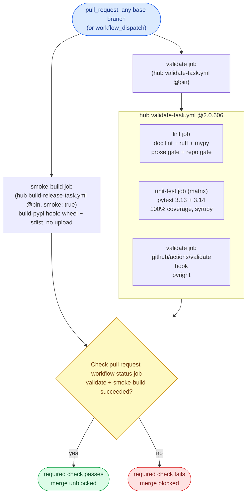
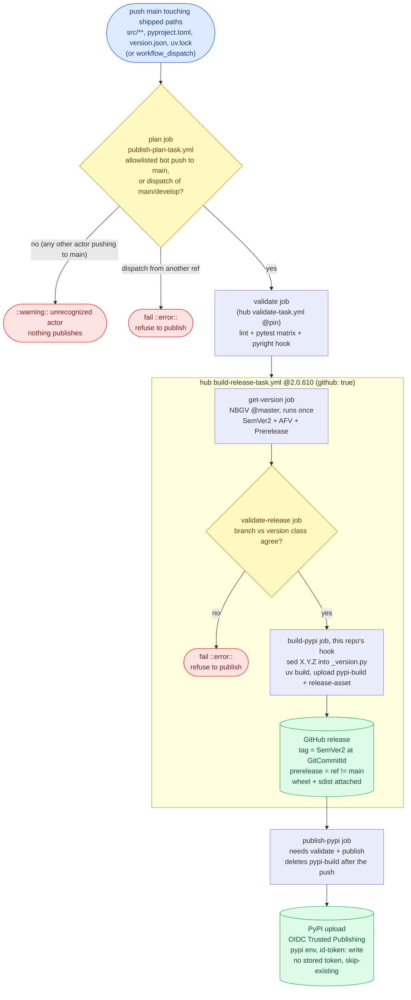
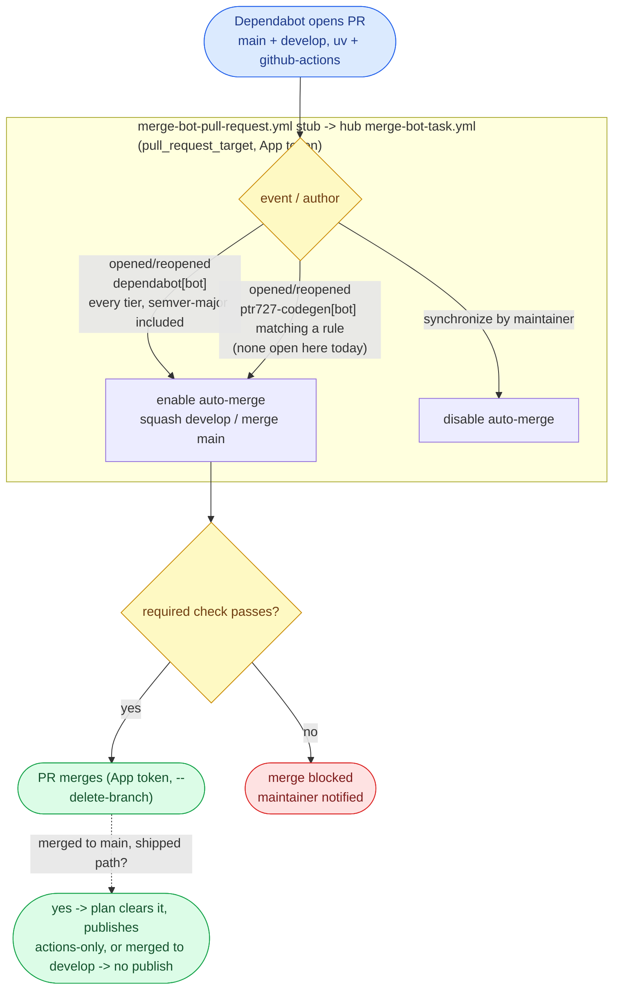

# WORKFLOW.md

The single guide for this repo's CI/CD **workflows** (GitHub Actions): the model, a **behavioral contract** (expected inputs and outputs), and how to verify it. Source style lives in [`CODESTYLE.md`](./CODESTYLE.md), and human-process rules (branching, versioning policy, review etiquette) live in [`GOVERNANCE.md`](./GOVERNANCE.md). This file covers everything under [`.github/workflows/`](./.github/workflows/).

It **describes required outcomes, not a required implementation.** A workflow is correct when it satisfies the contract, whatever shape its YAML takes. Each guarantee names the **failure it prevents**, so the reason survives a reimplementation.

The section numbering and the D-item numbering follow the fleet contract, so a rule elsewhere citing "section 4" or "D9.3" resolves here.

## Adaptation

This repo is a **`uv`-managed Python library** on the **`release`** workflow model, shipping **one target**: the PyPI distribution `ptr727-aiopurpleair`. An item of the contract governing a construct this repo does not have is **recorded N/A, not failed**.

- **Two-phase, matching the fleet.** A **human merge never auto-cuts a release**. Publishing happens on a code-merge to `main` by an **allowlisted** bot, meaning `ptr727-codegen[bot]` or `dependabot[bot]`, or on a deliberate `workflow_dispatch` of `main` or `develop`. Any other actor pushing to `main` gets a `::warning::` and no release, which is D8.4's requirement rather than an accident of the allowlist. The decision has one definition, the hub's `publish-plan-task.yml`, which every job in the publisher gates on. This repo reached that late: the change was written on 2026-07-10 and landed only now, after LanguageTags, Utilities and PlexCleaner. The registry entry records `releaseTrigger: two-phase`, and the registry schema no longer admits the old value.
- **Applicable scenarios:** S1 through S14 in section 5.
- **Recorded N/A** (single target, no Docker **image**, no wrapper, no deploy): **D1.1** and **D1.4** (a paths-filter over multiple targets, this repo smoke-builds its one target on every pull request), **D3.5** (no upstream-version tracker), **D4.6** (no deploy to an owned host), **D5.6** (no deploy to a host this repository owns, PyPI's versions being immutable rather than retained by count), **D6.3** and **D6.4** (one target, so no branch-suffix collision surface and no add/drop matrix), **D7.4** (no optional-dependency chaining), **D8.3** (no tracker), and **D9.4** (no Docker layer cache).
- **Default branch is `main`.** The default-branch literals name it identically, and a divergence is a defect: the hub task's `prerelease` expression (`!= 'main'`) and [`version.json`](./version.json)'s `publicReleaseRefSpec` (`^refs/heads/main$`). The `build-pypi` hook's PEP 440 `.dev0` test is the one branch literal naming `develop` instead, the two-branch rule D3.4 states.
- **NBGV owns the release tag** although nothing is compiled. The .NET SDK is pulled in solely as the versioning toolchain.

## 1. Purpose and How to Use This Document

Read section 4 for what the pipeline must do, and section 5 for how to prove it does. Section 3 explains why the pieces are shaped the way they are, and is the section to read before changing one.

### The Model at a Glance

aiopurpleair ships **one target**: the PyPI distribution **`ptr727-aiopurpleair`** (a wheel + sdist), built from the library source in [`src/aiopurpleair/`](./src/aiopurpleair/). PyPI is a **push** distributor, meaning a consumer pins the package and `pip install`s it, so a shippable change is worth getting to PyPI promptly. A dependency bump gets there unattended, since the merge-bot merges it under an allowlisted identity. A change you promote yourself is released by dispatching the publisher, which is the deliberate step the two-phase model asks for. Two workflows do the work:

- **CI** ([`test-pull-request.yml`](./.github/workflows/test-pull-request.yml)) runs on **every pull request, whatever its base branch**: it validates (lint + the 3.13/3.14 pytest matrix) and proves the wheel + sdist build (a smoke build), publishing nothing. A pull request merges only when its one required check is green.
- **The publisher** ([`publish-release.yml`](./.github/workflows/publish-release.yml)) runs on a **paths-filtered push to `main`** and on **`workflow_dispatch`**, and a first `plan` job decides whether the run publishes at all. It publishes on a code-merge to `main` by an **allowlisted** bot (`ptr727-codegen[bot]` or `dependabot[bot]`), or on a dispatch of `main` or `develop`. A merge to `main` by anyone outside that allowlist publishes nothing, a human and an unrecognized App alike. `main` cuts a **stable** release (clean PEP 440 `X.Y.Z`), by an allowlisted bot's merge or by dispatch, and `develop` cuts a **prerelease** (`X.Y.Z.dev0`) by dispatch only, since no push to `develop` reaches a trigger. When it does publish it re-runs the identical validate suite, builds and versions once, cuts a GitHub release, and uploads to PyPI over **OIDC Trusted Publishing** with no stored token.

There is no two-branch matrix: one run builds, versions, and publishes exactly its own trigger ref. Dependabot pull requests merge themselves once their checks pass, on both branches.

### Glossary

- **Entry workflow** - has `pull_request` / `push` / `workflow_dispatch` triggers. The orchestrator an event or a person starts.
- **Reusable workflow (task)** - a `workflow_call` workflow invoked through a `uses:` reference, never triggered directly. File ends in `-task.yml`.
- **Target** - the one shipped output: the PyPI wheel + sdist `ptr727-aiopurpleair`, built by the hub's `build-release-task.yml` through this repository's [`build-pypi`](./.github/actions/build-pypi/action.yml) hook and uploaded by `publish-release`'s `publish-pypi` job.
- **Release chain** - the hub's `build-release-task.yml`, reached at `ptr727/ProjectTemplate/.github/workflows/build-release-task.yml@f4e3f313 # 2.0.610` by both CI's `smoke-build` and the publisher's `publish` job, and the hub's `get-version-task.yml` it calls in turn. This repository carries neither, per the `retire` disposition in the hub's `spec/divergences.json`, and supplies only the `build-pypi` hook, which replaces the hub's `pypi-build-default` to keep the package version equal to the release tag and the wheel + sdist attached to the release.
- **Validate task** - the hub's `validate-task.yml`, reached at `ptr727/ProjectTemplate/.github/workflows/validate-task.yml@9d5a0c02 # 2.0.606`. Three jobs: `lint` (the fleet doc-lint block, `ruff`, `mypy`, the prose gate and the repo gate), `unit-test` (the pytest matrix this repository names through `python-versions`, 100% coverage, syrupy snapshots, best-effort Codecov upload), and `validate`, which resolves this repository's own [`.github/actions/validate`](./.github/actions/validate/action.yml) hook and runs `pyright` there. CI runs it on every pull request, and the publisher runs the **identical** pin before any release. This repository carries no copy of the task, per the `retire` disposition in the hub's `spec/divergences.json`.
- **Smoke build** - a run of the hub's `build-release-task.yml` with `smoke: true`, which builds the wheel + sdist through the same `build-pypi` hook to prove the release pipeline still produces a valid package, uploading and publishing nothing. Its `validate-release` version gate is skipped on smoke.
- **Shipped path** - the paths-filter inclusion list on the publisher's push trigger: `src/aiopurpleair/**`, `pyproject.toml`, `version.json`, `uv.lock`. Touching one of these on an **allowlisted bot** merge to `main` publishes, and a docs, test, or workflow-only merge does not. The filter governs the **push** trigger only, so it decides whether a merge starts a run at all. A `workflow_dispatch` carries no paths filter and always starts one. Either way the `plan` job is what decides whether that run publishes.
- **Shipped version** - NBGV's version, computed from `version.json` (SemVer base `1.0`) plus git height. `main` is the public ref (clean `X.Y.Z`); every other branch carries NBGV's `-g{sha}` prerelease segment. The PEP 440 package version is its `X.Y.Z` (`develop` -> `.dev0`), `sed`-stamped into `_version.py` at build by the `build-pypi` hook.
- **GitHub App token** - a short-lived installation token from `actions/create-github-app-token`, minted from `CODEGEN_APP_CLIENT_ID` / `CODEGEN_APP_PRIVATE_KEY`. The merge-bot uses it, not `GITHUB_TOKEN`: a `GITHUB_TOKEN` merge does not trigger the downstream publish push, and that token is read-only on Dependabot PRs.

## 2. Workflow Style Conventions

Legibility rules. Necessary but not sufficient: a perfectly styled workflow can still violate section 4.

- **Action pinning.** Pin every action to a commit SHA with a trailing `# vX.Y.Z` comment. The **sole exception is `dotnet/nbgv@master`** (see D9.1): its tag stream lags `master`, so Dependabot tag-tracking would only propose downgrades. It is used in the hub's `get-version-task.yml`, which documents the rationale inline, and this repository no longer carries a copy.
- **Filename.** Reusable workflows end in `-task.yml` and are `uses:`-d, never triggered directly; entry workflows end in what they do (`-pull-request.yml`, `-release.yml`).
- **Names.** Reusable workflow `name:` ends in **"task"**, entry names in **"action"**. Every job `name:` ends in **"job"**, every step `name:` in **"step"** - the aggregator included (`Check pull request workflow status job`). A job name bound as a ruleset required-check `context:` is changed only **in lockstep** with the live ruleset, which is applied from the hub's payloads. This repository carries none of its own.
- **Concurrency.** CI keys on `${{ github.workflow }}-${{ github.ref }}` with `cancel-in-progress: true`. The **publisher** overrides it: a ref-independent group (`group: ${{ github.workflow }}`) with `cancel-in-progress: false`, so a stable and a prerelease publish serialize and none is cancelled mid-release (which could leave a half-created GitHub release or a partial PyPI upload). The **merge-bot** keys on the PR number with `cancel-in-progress: false`.
- **Shells.** Every multi-line bash `run:` starts with `set -Eeuo pipefail`, which is D9.3's form: the `-E` propagates an `ERR` trap into functions and subshells, so a trap added later actually fires. Multi-line `if:` uses the folded scalar `if: >-`.
- **Boolean inputs.** A boolean used by both `workflow_call` and `workflow_dispatch` is declared in both trigger blocks and compared against `true` and `'true'`.
- **Reusable-workflow permissions.** Job-level `permissions:` are validated before `if:`, so grant least privilege at the callee and let the caller add scope (e.g. `contents: write` for the GitHub release) at the `uses:` job - the read-only smoke caller must not be forced to over-grant.

## 3. Architecture

### Two workflows: CI on pull request, publishing on push-plus-dispatch

CI ([`test-pull-request.yml`](./.github/workflows/test-pull-request.yml)) and the publisher ([`publish-release.yml`](./.github/workflows/publish-release.yml)) are separate workflows with separate concurrency, so they never race. CI re-tests every pull request and never publishes, and the publisher releases on an allowlisted bot's shipped-path merge to `main`, or on a deliberate dispatch. *Prevents a CI run from racing a publish on the same ref.*

### The publisher is scoped by branch, by path, and by who pushed

The workflow runs on a `push` to `main` filtered to the shipped paths (`src/aiopurpleair/**`, `pyproject.toml`, `version.json`, `uv.lock`), or on a `workflow_dispatch`. Whether that run **publishes** is the `plan` job's decision, and it turns on the actor as well as the ref: a merge to `main` by `ptr727-codegen[bot]` or `dependabot[bot]` publishes, any other actor's merge does not, and a dispatch of `main` or `develop` does. The ref then decides the version class: `main` -> stable clean SemVer, `develop` -> `.dev0` prerelease. The paths filter is deliberate, so a docs, test, or workflow-only push to a release branch does not consume a version. `uv.lock` is in the list because a PyPI version cannot be re-pushed, so a dependency bump must republish to keep the package's declared dependencies current, closing the stale-dependency window. *Prevents both a no-op republish on a docs change and a silently stale dependency set after a lock bump.*

### Validate is one definition, run by both entry points

The hub's `validate-task.yml`, reached at `ptr727/ProjectTemplate/.github/workflows/validate-task.yml@9d5a0c02 # 2.0.606`, is the whole quality gate: a `lint` job (`ruff check` + `ruff format --check` + `mypy` + the prose and repo gates), a `unit-test` job (the 3.13/3.14 pytest matrix with a 100% coverage gate and syrupy snapshots), and a `validate` job running this repository's `pyright` hook. CI's `validate` job and the publisher's `validate` job both `uses:` it **at the same pin**, and `publish-pypi` `needs:` the publisher's copy. The pin is what keeps them one definition now that the file is not carried here, so the two `uses:` lines move together or not at all. One step differs by event rather than by definition: the prose gate is guarded on `github.event.pull_request`, so the publisher's run executes it not at all. *Keeps the PR gate and the publish gate the same definition, so nothing publishes that would fail a pull request on anything the publisher's event reaches.*

### Versioning: compute once, thread everywhere

NBGV runs in exactly **one** job, the hub's `get-version-task.yml`, which the hub's `build-release-task.yml` calls once, and every consumer (the version gate, the build, the release) reads its outputs via `needs:`; no job re-invokes NBGV. It classifies from the trigger ref, `GITHUB_REF`, with no `IGNORE_GITHUB_REF` override. The carried copy this repository used to run set that override, which made NBGV read the checked-out branch instead, and dropping it with the copy is what the new shape requires rather than a neutral change: the publisher now passes `ref: ${{ github.sha }}`, a bare commit with no branch to read, so the override would classify a `main` publish as a prerelease. `GITHUB_REF` names the trigger branch on every publishing trigger, a push to `main` or a dispatch of `main` or `develop`, so the version class is the one the carried copy produced. `main` (the public ref, `publicReleaseRefSpec = ^refs/heads/main$`) builds a clean `X.Y.Z`; every other branch a prerelease. *Keeps the stamped `_version.py`, the wheel version, and the release tag in agreement.* NBGV needs only `version.json` (base `1.0`) and git height, so it works although the repo builds no .NET assembly.

### Build: gate the classification, stamp the version, build the package

The hub's `build-release-task.yml` versions once, then in `validate-release` asserts that `inputs.branch` and the version class agree before any build (`main` must have no prerelease `-` segment; every other branch must carry one) - a fail-fast on a misclassification, skipped on smoke. Its `build-pypi` job checks out the exact `GitCommitId` and, finding this repository's [`build-pypi`](./.github/actions/build-pypi/action.yml) hook, runs it in place of the hub's `pypi-build-default`. The hook takes the first three segments of `AssemblyFileVersion` as the PEP 440 version (`develop` -> `X.Y.Z.dev0`, else `X.Y.Z`), which for this two-part base are `SemVer2`'s core and so the release tag, `sed`s it into `_version.py` (the placeholder hatchling reads; the rewrite is on the runner only, no commit), and runs `uv build`. The hub default would publish all four segments, the fourth derived from the commit id, so the package would never match its tag (ptr727/ProjectTemplate#1521). On a real publish the hook uploads the wheel + sdist twice, as `pypi-build-<branch>` for `publish-pypi` and as `release-asset-<branch>-pypi` for the hub's `github-release` job (gated `inputs.github && !inputs.smoke`), which cuts the GitHub release.

### Self-testing workflows, and the required-context invariant

CI runs on `pull_request`, and that run is the ordinary producer of the aggregator's ruleset-bound `context:`. Adding `push` back alongside it would create a second producer of the same context on the same head SHA and race it.

**`workflow_dispatch` is a second producer already, and is the one hole in this.** A dispatch of this workflow on a pull request's head branch posts the same context and can satisfy the ruleset, while the hub's prose gate skips, being guarded on `github.event.pull_request`. So a dispatched run is a weaker gate wearing the required check's name. It predates the trigger change rather than arriving with it, and the reason to know it is that a dispatch is now the only way to produce that context without the prose gate having run.

**Self-testing now reaches only the hooks.** Every task this repository runs is the hub's and is reached at a pin: `validate-task.yml`, `build-release-task.yml` and the `get-version-task.yml` and `build-docker-task.yml` it calls, `publish-plan-task.yml`, and `merge-bot-task.yml`. The Docker task never runs here, `enable_docker` being `false`, but it is loaded at the release chain's pin all the same, so a job-level `permissions:` block added to it upstream would startup-fail the read-only `smoke-build` once the pin moves, and a pin bump is where to look for one. A change to any of them lands in the hub, and this repository sees it when a pin moves. What a pull request here still exercises head-resolved is the two hooks the hub tasks resolve from this repository's own checkout, [`.github/actions/validate`](./.github/actions/validate/action.yml) and [`.github/actions/build-pypi`](./.github/actions/build-pypi/action.yml). That is the trade the `retire` disposition asks for. Two of those pins are shared, `validate-task.yml` and `build-release-task.yml`, each reached by both CI and the publisher, and each shared pin's two `uses:` lines must carry the same SHA.

**Forks now produce a run.** A fork pull request triggers `pull_request` here and can satisfy the required check, where under the old `push` trigger it produced no run and a maintainer had to land the change on an in-repo branch first. The repository's fork-PR approval policy is `first_time_contributors`, so a new contributor's first run still waits on a maintainer's **Approve and run**. That is a hold rather than the old dead end, since the run then posts the required context by itself.

**The smoke build versions an ephemeral ref.** On a `pull_request` event the hub's `get-version-task.yml` checks out `refs/pull/N/merge` and exports that commit as `GitCommitId`, and the `build-pypi` job then re-fetches it by bare SHA. GitHub recomputes the merge ref when the **base** branch moves, so a base push between the two jobs can leave that SHA named by no ref and fail the checkout. `cancel-in-progress` covers a push to the pull request's own head and not this. Under the old `push` trigger the SHA was always a durable branch commit. The exposure is a smoke build failing spuriously and rerunning green rather than anything shipping wrong. The release-chain adoption was expected to remove it and did not, since the hub task has the same two-job shape the carried copy had.

**The `pull_request:` trigger is deliberately unfiltered by base branch**, where the fleet stub names `[main, develop]`. Retargeting a pull request fires activity type `edited`, which is not in the default type set, so no run follows a retarget. Filtering by base would therefore have left a stack retargeted from a feature branch onto `develop` waiting forever on a context no run would post, blocked in exactly the state a filter is supposed to keep cheap. Unfiltered, every pull request gets its run at `opened`, the context lands on the head SHA, and a retarget carries it along because the head SHA does not change. **What that carries is a context earned against the old base.** The run validated `refs/pull/N/merge` computed against the branch the pull request used to target, and since both rulesets are non-strict nothing forces a revalidation after the retarget, so the check is green on a merge that was never tried. A push to the branch clears it, `synchronize` being in the default type set. The same non-strict setting already allows a stale-but-green merge without any retarget, so this widens an existing gap rather than opening one. Stacked pull requests are avoided here for an unrelated reason recorded in the issue history: deleting a base branch on merge closes its children irrecoverably.

**Nothing validates a post-merge tip any more.** **Recorded drift.** Both live rulesets set `strict_required_status_checks_policy: false`, so a pull request green against an older `develop` merges without revalidation, and no run follows the merge: `develop` has no trigger of its own now, and the publisher's `validate` job is gated behind `needs.plan.outputs.publish == 'true'`, which a human promotion merge to `main` does not satisfy. Under the old `push` trigger the post-merge tip of every branch was validated. The exposure is two pull requests, each green against an older base and textually conflict-free but semantically incompatible, merging minutes apart and leaving `develop` broken with no red run anywhere until the next pull request opens. Restoring a `push` leg on `develop` and `main` would close it without re-creating the dual-producer race, since a push run posts its context on a branch tip rather than on any pull request head.

### The single required check

One aggregator job, `Check pull request workflow status job`, is the ruleset-bound required check and gates the merge. It `needs:` both `validate` and `smoke-build` and fails on any non-success (it must **succeed**, not merely "not fail"). Its name must move only in lockstep with the live ruleset's required-check `context:`, which the hub's payloads apply.

### The single-target release

`github-release`, in the hub's `build-release-task.yml` with `github: true`, downloads the `release-asset-<branch>-*` artifacts, and `softprops/action-gh-release` creates the tag + release with auto-generated notes, attaching the wheel + sdist plus `LICENSE` and `README.md` (`fail_on_unmatched_files: true`, `expect_release_assets` keeping its default). It skips the create when a release for the tag already exists, except on a dispatch, which refreshes it, and it deletes the consumed `release-asset-*` artifacts after a create or refresh. `target_commitish` is set explicitly to the built `GitCommitId` so the tag lands on the built commit, not the API's default branch. The GitHub-release `prerelease` boolean is `inputs.branch != 'main'`. Then `publish-pypi` downloads `pypi-build-<branch>`, uploads it to PyPI over OIDC Trusted Publishing in the `pypi` environment (`id-token: write`, `skip-existing: true`) - no stored key - and deletes the artifact. That push stays in this repository's `publish-release.yml` rather than moving into the hub task, because the OIDC token's `job_workflow_ref` claim names the workflow file a job ran from, and the PyPI trusted publisher registration names this one.

### Self-sufficiency: Dependabot on both branches

Dependabot pull requests merge themselves once the required check passes - **every tier, semver-major included**: the required check is the gate, not the version bump. Dependabot is **dual-target** (`main` **and** `develop`) so both branches stay current and never drift apart; a `develop` bump lands as a `.dev0` prerelease republish, a `main` bump as a stable republish (a `uv.lock` bump hits a shipped path, so it publishes; an actions-only bump does not). The [merge-bot](./.github/workflows/merge-bot-pull-request.yml) enables auto-merge on `opened`/`reopened` (squash on `develop`, merge-commit on `main`, by the PR's base ref) and disables it when a maintainer pushes to a bot branch.

### Flow diagrams

Three diagrams trace the architecture above: the pull-request gate, the publisher, and the bot automation. They depict the same outcomes the section 3 contract specifies, drawn from the workflow YAML; if a diagram and a guarantee disagree, one of them is a defect. Triggers are blue, gates yellow, durable/published outputs green, and stop/skip outcomes red.

**Pull request (CI), `test-pull-request.yml`.** Every pull request, whatever its base branch, runs the hub's validate task at a pin (lint + the 3.13/3.14 pytest matrix + the pyright hook) and a smoke build through the hub's release chain, also at a pin, and a single aggregator produces the ruleset-bound required check (D1, D5).

```mermaid
flowchart TD
    T(["pull_request: any base branch<br/>(or workflow_dispatch)"]):::trig
    T --> V["validate job<br/>(hub validate-task.yml @pin)"]
    T --> SB["smoke-build job<br/>(hub build-release-task.yml @pin, smoke: true)<br/>build-pypi hook: wheel + sdist, no upload"]
    subgraph VT ["hub validate-task.yml @2.0.606"]
        LN["lint job<br/>doc lint + ruff + mypy<br/>prose gate + repo gate"]
        TS["unit-test job (matrix)<br/>pytest 3.13 + 3.14<br/>100% coverage, syrupy"]
        VH["validate job<br/>.github/actions/validate hook<br/>pyright"]
    end
    V --> VT
    VT --> A{"Check pull request workflow status job<br/>validate + smoke-build succeeded?"}:::gate
    SB --> A
    A -- "yes" --> G(["required check passes<br/>merge unblocked"]):::pub
    A -- "no" --> R(["required check fails<br/>merge blocked"]):::stop
    classDef trig fill:#dbeafe,stroke:#2563eb,color:#1e3a8a
    classDef gate fill:#fef9c3,stroke:#ca8a04,color:#713f12
    classDef pub fill:#dcfce7,stroke:#16a34a,color:#14532d
    classDef stop fill:#fee2e2,stroke:#dc2626,color:#7f1d1d
```

**Publish, `publish-release.yml` into `build-release-task.yml`.** A run that the `plan` job clears, meaning an allowlisted bot's shipped-path merge to `main` or a dispatch, runs the same validate suite, versions once, cuts the GitHub release, and uploads to PyPI over OIDC (D2, D3, D4).

```mermaid
flowchart TD
    P(["push main touching shipped paths<br/>src/**, pyproject.toml, version.json, uv.lock<br/>(or workflow_dispatch)"]):::trig --> PLAN
    PLAN{"plan job<br/>publish-plan-task.yml<br/>allowlisted bot push to main,<br/>or dispatch of main/develop?"}:::gate
    PLAN -- "no (any other actor pushing to main)" --> NOP(["::warning:: unrecognized actor<br/>nothing publishes"]):::stop
    PLAN -- "dispatch from another ref" --> DX(["fail ::error::<br/>refuse to publish"]):::stop
    PLAN -- "yes" --> VAL["validate job<br/>(hub validate-task.yml @pin)<br/>lint + pytest matrix + pyright hook"]
    VAL --> BUILD
    subgraph BUILD ["hub build-release-task.yml @2.0.610 (github: true)"]
        GV["get-version job<br/>NBGV @master, runs once<br/>SemVer2 + AFV + Prerelease"] --> VR{"validate-release job<br/>branch vs version class agree?"}:::gate
        VR -- "no" --> VRX(["fail ::error::<br/>refuse to publish"]):::stop
        VR -- "yes" --> BD["build-pypi job, this repo's hook<br/>sed X.Y.Z into _version.py<br/>uv build, upload pypi-build + release-asset"]
        BD --> REL[("GitHub release<br/>tag = SemVer2 at GitCommitId<br/>prerelease = ref != main<br/>wheel + sdist attached")]:::pub
    end
    REL --> PP["publish-pypi job<br/>needs validate + publish<br/>deletes pypi-build after the push"]
    PP --> PYPI[("PyPI upload<br/>OIDC Trusted Publishing<br/>pypi env, id-token: write<br/>no stored token, skip-existing")]:::pub
    classDef trig fill:#dbeafe,stroke:#2563eb,color:#1e3a8a
    classDef gate fill:#fef9c3,stroke:#ca8a04,color:#713f12
    classDef pub fill:#dcfce7,stroke:#16a34a,color:#14532d
    classDef stop fill:#fee2e2,stroke:#dc2626,color:#7f1d1d
```

**Automation, Dependabot plus the merge-bot.** Dependabot opens PRs on both branches, and the merge-bot enables auto-merge (or disables it on a maintainer push). A bump merged to `main` that touches a shipped path publishes on the resulting push, because the merge-bot's App identity is what the `plan` job allowlists. An Actions-only bump does not, and neither does a bump merged to `develop` (D8).

```mermaid
flowchart TD
    DEP(["Dependabot opens PR<br/>main + develop, uv + github-actions"]):::trig --> MB
    subgraph MBT ["merge-bot-pull-request.yml stub -> hub merge-bot-task.yml<br/>(pull_request_target, App token)"]
        MB{"event / author"}:::gate
        MB -- "opened/reopened<br/>dependabot[bot]<br/>every tier, semver-major included" --> EN["enable auto-merge<br/>squash develop / merge main"]
        MB -- "opened/reopened<br/>ptr727-codegen[bot] matching a rule<br/>(none open here today)" --> EN
        MB -- "synchronize by maintainer" --> DIS["disable auto-merge"]
    end
    EN --> CK{"required check passes?"}:::gate
    CK -- "yes" --> MRG(["PR merges (App token, --delete-branch)"]):::pub
    CK -- "no" --> BLK(["merge blocked<br/>maintainer notified"]):::stop
    MRG -. "merged to main, shipped path?" .-> PUB(["yes -> plan clears it, publishes<br/>actions-only, or merged to develop -> no publish"]):::pub
    classDef trig fill:#dbeafe,stroke:#2563eb,color:#1e3a8a
    classDef gate fill:#fef9c3,stroke:#ca8a04,color:#713f12
    classDef pub fill:#dcfce7,stroke:#16a34a,color:#14532d
    classDef stop fill:#fee2e2,stroke:#dc2626,color:#7f1d1d
```

## 4. Behavioral Contract: Expected Outcomes

The required behaviors, organized by domain. Each is a **MUST**, and its `Output:` states what a conforming pipeline is required to hold. A workflow that violates any **applicable** guarantee is **not operational**. Items recorded N/A for this repo are listed in "Adaptation" above and are not restated here.

### D1 - PR Fast-Feedback (Smoke)

- **D1.2 A validation job always runs.** Input: any pull request, whatever its base branch. Output: `test-pull-request` calls the hub's `validate-task` by pin and, as `smoke-build`, the hub's `build-release-task` by pin, with no paths filter, and the aggregator `needs:` both. The hub task has **three** jobs. `lint` runs the fleet doc-lint block (`markdownlint-cli2` over `**/*.md`, `cspell` over `README.md` and `HISTORY.md`, `actionlint`, and `editorconfig-checker`), then `ruff check` and `ruff format --check`, then `mypy`, then the fleet prose gate and repo gate. `unit-test` runs the pytest matrix over the interpreters this repository names in `python-versions`, currently 3.13 and 3.14, with the 100% coverage gate and syrupy snapshots, `fail-fast: false` so both interpreters report. `validate` resolves this repository's own `.github/actions/validate` hook and runs `pyright` there. **The hook is not optional decoration.** The hub's lint job runs `mypy` or `pyright` and never both, taking `mypy` wherever a `pyproject.toml` declares `[tool.mypy]`, so without the hook adopting the task would have dropped `pyright`, and with it the only type checking this repository does over its tests, while the job still reported success. `mypy` is likewise given its target by `files = ["src"]` in `pyproject.toml` rather than on the command line, because the hub task runs a bare `uv run mypy`, which exits 2 without it. Both are undocumented preconditions of adoption (ptr727/ProjectTemplate#1516). The hub `lint` job carries one `Check shell scripts step` running `shellcheck` and `shfmt -d`, which discovers shell scripts itself and no-ops on an empty set, with a PowerShell peer step beside it, so this repository runs them and they find nothing, the tree carrying no `.sh` and no shell shebang. **Adding one activates both with no edit here**, which is the opposite of the arrangement this repository had while it carried its own task, where a shell script meant adding the step back by hand. Embedded workflow `run:` blocks still get `shellcheck`, but conditionally rather than by guarantee: `actionlint` runs that integration only when `shellcheck` is on `PATH`, and it is there because `ubuntu-latest` preinstalls it. A runner image that dropped it would leave `actionlint` warning that the ShellCheck checks were skipped and still passing the job, so the loss is visible in the log and invisible in the result. That integration does not enforce **D9.3** either way, since no `shellcheck` rule requires `set -Eeuo pipefail`. D9.3 is a convention held by review rather than by a tool. All three jobs gate the aggregator, so a markdown, spelling, EditorConfig, actionlint, prose, or repo-gate failure reds the required check exactly as a test failure does. The branch-deletion guard this guarantee used to carry is gone with the `push` trigger it existed for: a deletion cannot raise a `pull_request` event. *Prevents: a PR merging with no validation, and a reusable-workflow or build break shipping untested.*
- **D1.3 Smoke never publishes and never uploads.** Input: `smoke: true`. Output: the hub `build-release-task` builds the wheel and sdist through the `build-pypi` hook to prove the release path still produces a valid package. Both of the hook's uploads are guarded on `smoke`, the task's `github-release` job is off at the job level (`inputs.github && !inputs.smoke`, and CI leaves `github` at its `false` default), and `publish-pypi` exists only in the publisher. *Prevents: a CI run publishing, and orphaned artifacts churning the storage quota.*
- **D1.5 One required aggregator gates merge.** Input: any PR. Output: a single aggregator job, `Check pull request workflow status job`, must **succeed**. It runs under `if: ${{ always() }}` so a failed or skipped dependency cannot skip the gate itself, `needs:` `validate` and `smoke-build`, and blocks on `failure` and `cancelled`. It is the ordinary producer of the ruleset-bound `context:`. Two other paths post the same context: a `workflow_dispatch` of this workflow, recorded above, and two open pull requests sharing one head branch, whose runs key concurrency on their own `refs/pull/N/merge` and so do not cancel each other, leaving whichever finishes last as the reported result. Its job `name:` and the ruleset `context:` are the same string and are renamed **only** in lockstep. The `context:` that binds is the one in the **live** ruleset, applied from the hub's payloads, and this repository carries no copy of them. A fork pull request produces a run here and satisfies the check on its own, the `pull_request` trigger reaching a fork where the old `push` trigger did not. *Prevents: a dual-producer context race, and a defect merging unverified.*
- **D1.6 Coverage is reported to Codecov.** Output: the hub task's `unit-test` job runs pytest under coverage and a `codecov/codecov-action` step uploads the report **best-effort** (`continue-on-error`, `fail_ci_if_error: false`), so a Codecov outage or an absent token never reds the gate. [`codecov.yml`](./codecov.yml) sets both the project and patch statuses `informational: true`, the fleet's advisory default, so **Codecov gates nothing here**. The gate that does bite is `pytest`'s own `fail_under = 100` in [`pyproject.toml`](./pyproject.toml), which is a `unit-test`-job failure rather than a Codecov status. *Prevents: coverage silently going unreported, and a Codecov outage blocking an unrelated pull request.*

### D2 - Input/State Validation at Entry

- **D2.1 Validate before expensive work.** Output: the hub `build-release-task`'s `validate-release` job asserts the branch and version class agree before any build, and the `build-pypi` job `needs:` it. *Prevents: spending a build on a tree that is already misclassified.*
- **D2.2 Release branch matches version classification.** Input: a real (non-smoke) release build. Output: the gate fails loudly if `main` carries a prerelease `-` segment, or a non-`main` branch carries none. It reads `inputs.branch`, which the publisher sets to `github.ref_name`. On a smoke build the **check exits early while the job still reports success**, read as the validation being skipped rather than the job, since a job-level `if:` would skip dependents with it. **The early exit is load-bearing now.** The carried task keyed the gate on `github.ref_name`, which on a pull request is `N/merge` and so never entered the `main` arm, which left the exit defensive only. The hub task keys it on `inputs.branch`, and CI passes the base branch there, so a `develop -> main` promotion pull request arrives with `branch: main` while NBGV versions its merge ref as a prerelease. Without the exit, every promotion pull request would fail the `main` arm. *Prevents: a `develop` build published as stable, and the gate blocking every promotion PR.*
- **D2.3 Publish only from `main` or `develop`.** Input: a dispatch publish. Output: the `plan` job fails fast with `::error::` on a dispatch from any other ref, before any build runs. The `pypi` deployment environment's branch restriction remains underneath as defense in depth. *Prevents: cutting a release from an unintended branch.*

### D3 - Versioning and Classification

- **D3.1 One branch per run, versioned once.** Output: the run versions, builds, and tags exactly `github.ref_name`, driven into `build-release-task` as the `branch` input. There is no matrix and no `branch` input that can disagree with the ref. NBGV runs in exactly **one** job, the hub's `get-version-task`, classifying from the trigger ref with no `IGNORE_GITHUB_REF` override, and emits `SemVer2`, the three assembly versions, `GitCommitId` and a derived `Prerelease` flag. The publisher passes `ref: ${{ github.sha }}`, so the commit versioned is the one that triggered. Every consumer reads those through `needs:`, and no job re-invokes NBGV. *Prevents: publishing a branch other than the one that triggered, and the stamped version diverging from the tag.*
- **D3.2 Default = public, others = prerelease.** Output: `main` produces a clean `X.Y.Z` under `publicReleaseRefSpec = ^refs/heads/main$`, and every other branch produces `X.Y.Z-g<sha>`. The default-branch literal in the gate, the `prerelease` expression, and `version.json` all name `main`.
- **D3.3 Version floor + git height.** Output: [`version.json`](./version.json) sets the major.minor floor, currently `1.0`, and NBGV appends the git height as the patch, never bumped on a cadence. It also sets **`versionHeightOffset: -1`**, so the published patch is the height minus one. That offset is load-bearing rather than incidental. Patch equals git height plus the offset, so removing it raises every subsequent patch by one and **skips a version**: a release that would have been `1.0.12` publishes as `1.0.13`. PyPI accepts that, since it sorts above everything published, so the change is silent rather than caught, and the gap is permanent because a PyPI version cannot be re-pushed later to fill it. NBGV and `version.json` are retained although this repo compiles nothing, because they own the tag. *(Who raises the floor and when is a human-process rule in `GOVERNANCE.md` "Release Model", with this repo's own facts in `OPERATIONS.md` "Release and Versioning Facts".)*
- **D3.4 Registry versions follow the classification.** Output: the PEP 440 package version is the release tag's `X.Y.Z`, which the [`build-pypi`](./.github/actions/build-pypi/action.yml) hook takes as the first three segments of `AssemblyFileVersion`, for this two-part base `SemVer2`'s core, with `.dev0` appended on `develop` only, a two-branch literal rather than a generic rule. The hook refuses an `AssemblyFileVersion` that is not four numeric segments rather than guessing. The fourth segment is deliberately dropped, being derived from the commit id, which is why this repository carries the hook rather than taking the hub's `pypi-build-default` (ptr727/ProjectTemplate#1521). The version is `sed`-stamped into [`_version.py`](./src/aiopurpleair/_version.py) on the runner after the frozen `uv sync`, then `uv build` produces the wheel and sdist. **No version is committed to git.** The `develop` `.dev0` build stays `pip install --pre`-selectable and sorts above the `main` release, the git height keeping develop ahead. *Prevents: a develop leg published as a release, a package version that never matches its tag, and a dirty tree.*

### D4 - Release / Publish

- **D4.1 Gated single-branch publish.** Output: PRs smoke-test and publish nothing, and **a human merge never auto-publishes**. A first `plan` job decides once and every job gates on its output: publish on a **code-affecting push to `main` by an allowlisted bot**, the allowlist being `ptr727-codegen[bot]` and `dependabot[bot]` compared against `github.actor`, or on a **dispatch** of `main` or `develop`. **Any** other actor pushing to `main` emits a `::warning::` naming it and publishes nothing, a human and a renamed or newly installed App alike, so a release bot under a new identity fails loudly rather than silently. The `push` trigger is `main`-only and filtered to the shipped paths (`src/aiopurpleair/**`, `pyproject.toml`, `version.json`, `uv.lock`), so a docs, test, or workflow-only merge marks nothing. `uv.lock` is in the list because a PyPI version cannot be re-pushed, so a dependency bump must republish to keep the declared dependency set current. A `develop` prerelease is a deliberate dispatch rather than a consequence of a merge. Each run builds one branch. *Prevents: a no-op republish on a non-shipping change, a silently stale dependency set after a lock bump, and a promotion merge shipping a release nobody asked for.*
- **D4.2 Tag the built commit.** Output: the hub task's `build-pypi` and `github-release` jobs check out `needs.get-version.outputs.GitCommitId`, and the release `target_commitish` is that SHA rather than a branch name, so the package, the tag, and the bundled files all match the commit NBGV versioned even if the branch advances mid-run. The `prerelease` boolean is `inputs.branch != 'main'`. *Prevents: a race between versioning and building, and a develop release's tag landing on main's tip.*
- **D4.3 Release contents.** Output: every release is a tag on the built commit plus auto-generated notes, with the wheel and sdist, `LICENSE`, and `README.md` attached under `fail_on_unmatched_files: true`, the wheel and sdist arriving as the `build-pypi` hook's `release-asset-<branch>-pypi` artifact. A run finding its tag already released skips the create, and a dispatch refreshes the release instead. *Prevents: a release missing its artifact.*
- **D4.4 No-op republish, and keyless upload.** Output: `publish-pypi` runs in the `pypi` environment with `permissions: id-token: write` and uploads via `pypa/gh-action-pypi-publish` over **OIDC Trusted Publishing**, under `skip-existing: true`, so the server dedupes a version that already exists rather than failing the run. There is **no** stored PyPI token, and the Trusted Publisher registration plus the environment's branch restriction is the whole trust chain. *Prevents: a leaked publish credential, since there is none to leak, and a hard failure on a re-run of an unchanged version.*
- **D4.5 A build failure blocks every publish target.** Output: `publish-pypi` `needs:` the publisher's `validate` job, which is the identical hub `validate-task` pin that CI runs, minus the prose gate its `github.event.pull_request` guard skips on a push or dispatch, so a regressed tip fails validation and never uploads. The push itself is what no gate can cover: it runs after the release job, so a rejected token exchange or a trusted-publishing policy naming the wrong workflow file leaves a published release and tag for a version that never reached PyPI. The recovery is a re-dispatch or a full re-run rather than a cleanup. *Prevents: publishing a tree that would fail the PR gate.*

### D5 - Resource Cleanup

- **D5.1 Delete at the point of consumption.** Output: each transfer artifact is deleted by its consumer, by exact name or branch-scoped pattern. The hub's `github-release` job deletes the `release-asset-<branch>-*` artifacts it attached, and `publish-pypi` deletes `pypi-build-<branch>` after its push. This was recorded drift while the carried task shared one artifact between both consumers and granted no job `actions: write`. *Prevents: transfer artifacts accumulating against the storage quota.*
- **D5.2 Gate the delete to the condition that made the artifact redundant.** Output: `github-release` gates its delete on the same condition as the release create, narrowed by `inputs.expect_release_assets`. `publish-pypi` gates its delete on `!cancelled() && steps.download.outcome == 'success'` rather than on the push, since a step with no `if:` inherits `success()` and would skip on exactly the failed push that left the artifact downloaded.
- **D5.3 Best-effort.** Output: both deletes are `continue-on-error`, tolerate a failed listing with a `::warning::`, and delete every matching id, since a re-run can upload duplicates. *Prevents: a cleanup hiccup reddening a job whose publish succeeded.*
- **D5.4 Retention backstop.** Output: both `upload-artifact` steps, the hook's `pypi-build-<branch>` and `release-asset-<branch>-pypi` handoffs, set `retention-days: 1`, the failure-path backstop behind D5.1. **D5.5** holds as well, since neither delete enumerates the run's whole artifact set.

### D6 - Seam / Architecture Conformance

- **D6.1 CI and the publisher are separate, and each builds one branch.** Output: `test-pull-request` and `publish-release` are separate workflows with separate concurrency, so they never race. CI validates the pull request's merge ref and publishes nothing, handing its smoke build the **base** branch as `branch:`, and the publisher versions, builds, and tags exactly its own trigger ref. The hub task's `build-pypi` job hands `publish-pypi` the `pypi-build-<branch>` artifact by `name:`, not `artifact-ids:`. *Prevents: cross-branch ref mixing, and a CI run racing a publish on the same ref.*
- **D6.2 Branch drives config.** **Recorded drift, narrowed rather than closed.** The hub `build-release-task` reads `inputs.branch` for every configuration it derives itself: `validate-release`'s gate, the `prerelease` expression, both artifact names, and the hook's `.dev0` derivation. The publisher passes `branch: ${{ github.ref_name }}`, and CI's `smoke-build` passes `branch: ${{ github.base_ref || github.ref_name }}`, because on a `pull_request` event `github.ref_name` is the pull request ref such as `123/merge` rather than a branch. The version class is the one read that does not follow `inputs.branch`: the hub's `get-version-task` has NBGV classify from `GITHUB_REF`, which on a pull request is `refs/pull/N/merge`, so a smoke build on a `pull_request` event versions as a prerelease whatever branch it names. A `workflow_dispatch` of this workflow on `main` is the exception, and a harmless one, since `base_ref` is then empty and `branch` and `GITHUB_REF` both name `main`. On a `develop -> main` promotion pull request that pairs `branch: main` with a `-g<sha>` version. It is harmless only because the smoke path skips every consumer of the pair, `validate-release` exiting early on `smoke: true` (D2.2) and both uploads being skipped, and on the publisher the two agree, since `GITHUB_REF` there names the branch `inputs.branch` does. **Removing the smoke early exit in `validate-release` reopens this item**, failing every promotion pull request on the `main` arm. **Letting a smoke build upload reopens it differently**, producing `pypi-build-main` and `release-asset-main-pypi` artifacts built from a merge ref and labelled as `main`. What the adoption did close is the carried task's split between `inputs.branch` and `github.ref_name` inside the task itself. *Prevents, where satisfied: a task behaving differently depending on how it was reached.*

### D7 - Concurrency, Permissions, Safety

- **D7.1 Publisher serializes.** Output: the publisher uses a **global, ref-independent** concurrency group (`group: ${{ github.workflow }}`) with `cancel-in-progress: false`, so a stable and a prerelease publish serialize and neither is cancelled mid-release. CI keys on `${{ github.workflow }}-${{ github.ref }}` with `cancel-in-progress: true`, and the merge-bot keys on the PR number with `cancel-in-progress: false`. *Prevents: a double push, and a cancelled publish leaving a half-created release or a partial upload.*
- **D7.2 A called job's permissions block is validated before its `if:`.** Output: reusable jobs grant least privilege at the callee, and the caller adds scope at the `uses:` job, `contents: write` for the GitHub release and `actions: write` for its artifact cleanup. `publish-pypi`, a job of the publisher's own, grants itself `id-token: write` for the OIDC upload and `actions: write` for its delete, and the publisher sets `permissions: {}` at the top so no job holds a scope it did not name. *Prevents: a `startup_failure` on the read-only smoke caller, which must not be forced to over-grant.*
- **D7.3 A `github.event.inputs` boolean is compared as a string.** Output: the booleans this repo passes, `smoke`, `github`, and the `enable_*` gates, reach the hub task only by `workflow_call`, where the `inputs` context preserves the declared boolean. The one crossing into a composite action, `smoke` into the `build-pypi` hook, arrives there as a string, so the hook compares it against `'true'`. A boolean that later gains a `workflow_dispatch` path is declared in both trigger blocks and compared against `'true'` on that path, since that context delivers every input as a string.

### D8 - Bots / Automation

- **D8.1 Merge-bot.** Output: runs on `pull_request_target` with the App token, merges the PR by URL without checking out its code, and passes `--delete-branch`. It enables auto-merge on `opened` and `reopened`, dispatching `--squash` on `develop` and `--merge` on `main` by the PR's base ref, and disables it when a maintainer pushes to a bot branch (`synchronize`, actor not the bot). Concurrency is keyed on the **PR number**. It uses the App token rather than `GITHUB_TOKEN`, because a `GITHUB_TOKEN` merge does not trigger the downstream publish push and that token is read-only on Dependabot PRs. **The job graph is hub-hosted**: [`merge-bot-pull-request.yml`](./.github/workflows/merge-bot-pull-request.yml) is a caller stub holding the trigger, the concurrency group, `permissions: {}`, the pinned `uses:`, the two App secrets, and `delete-branch: true`, which is how the `--delete-branch` above survives this repository's auto-delete-on-merge being off. The stub also inherits the task's App arm, which auto-merges the App's own pull requests on four **exact** head refs, `codegen-main` and `upstream-version-main` into `main` and `codegen-develop` and `upstream-version-develop` into `develop`. They are exact matches rather than prefixes, and this stub passes no `rules` input, so a head named anything else is annotated with a warning and left unmerged. This repository opens no App pull requests today, so the arm is capability rather than current behavior, and adding a tracker means adding a `rules` entry for its head and base alongside it. *Prevents: two PRs colliding in auto-merge, and a bot merge that silently fails to publish.*
- **D8.2 Dependabot auto-merges every tier, on both branches.** Output: every Dependabot PR auto-merges once the required check passes, **semver-major included**, because the required checks are the gate rather than the bump magnitude. [`.github/dependabot.yml`](./.github/dependabot.yml) targets **both** `main` and `develop`, each ecosystem listed once per branch. A merged shipped-path bump publishes on the resulting push, and an Actions-only bump does not. *Prevents: a safe update stalling on a human, and cross-branch drift.*
- **D8.4 An identity allowlist used as a gate fails loud.** Output: the merge-bot's failure is self-announcing, since bot PRs visibly pile up unmerged, so an annotation on the non-matching branch is optional here rather than required.
- **D8.5 Configuration outside the YAML is present.** Output: the secrets (`CODEGEN_APP_CLIENT_ID`, `CODEGEN_APP_PRIVATE_KEY`, and `CODECOV_TOKEN`, each in both the Actions and Dependabot stores), the `main` and `develop` rulesets, the repository settings, and the PyPI Trusted Publisher registration with its `pypi` environment restricted to `main` and `develop` are all in place. *Prevents: a green-looking repo whose first real publish or auto-merge fails on a missing secret, an unenforced ruleset, or an unregistered publisher.* Detail and the audit procedure are in section 6. **The `pypi` environment half of this guarantee is mechanized again.** The carried script that asserted its custom-branch-policy mode and its exact allowed-branch set was retired when the repository-configuration script became hub-hosted, and for a time nothing replaced it. The hub's script now checks the deployment environments the fleet registry declares, so that policy being widened, deleted, or flipped to protected-branches mode is caught. [`AUDIT.md`](./AUDIT.md) section 4 carries the expected values and names what the check still does not reach.

### D9 - Style / Static

`GOVERNANCE.md` "Workflow YAML Conventions" names the tool D9.1 excepts and states the suffix rules D9.2 requires.

- **D9.1** Every action is SHA-pinned with a trailing version comment. The **sole exception is `dotnet/nbgv@master`**, whose tag stream lags `master` so tag-tracking would only propose downgrades, and the rationale is documented inline in the hub's `get-version-task.yml`, the one place it is now used.
- **D9.2** File, workflow, job, and step names follow the suffix rules in section 2. The ruleset-bound aggregator's `name:` equals its ruleset `context:`, renamed together.
- **D9.3** Bash `run:` blocks start `set -Eeuo pipefail`. Multi-line `if:` uses the folded scalar `if: >-`.
- **D9.5** Line endings follow [`.editorconfig`](./.editorconfig): workflow YAML is LF, because Dependabot and Actions rewrite it with LF.

## 5. Test Methodology

Evaluate every job's `if:` and `needs:` against the scenario's inputs, statically from the YAML, and compare the predicted run/skip plus version plus release against the expected column. No execution is required.

| # | Input | Expected output | Exercises |
| --- | --- | --- | --- |
| S1 | PR into `develop` touching `src/aiopurpleair/**` | `validate` runs the full suite and `smoke-build` builds the package, **no publish**, aggregator success | D1.2, D1.3, D6.1 |
| S2 | PR into `develop` changing only docs | `validate` runs all three hub jobs, `smoke-build` runs, nothing publishes, aggregator success **only if the doc-lint block inside `lint` passes** | D1.2 |
| S3 | PR changing only `.github/workflows/**` or `.github/actions/**` | a changed hook (`validate`, `build-pypi`) is exercised head-resolved, a changed hub pin is not, since every task is the hub's, aggregator success | D1.2, D1.5 |
| S4 | shipped-path **bot** merge to `main` | `plan` returns `publish=true`, `validate` passes, `publish` cuts a **stable** `X.Y.Z` GitHub release at the built SHA, and `publish-pypi` uploads over OIDC | D3.2, D4.1, D4.2, D4.4 |
| S5 | `workflow_dispatch` on `develop` | publishes a **prerelease** `X.Y.Z.dev0` with `prerelease=true`, tagged at the develop SHA. A push to `develop` reaches no trigger at all | D3.4, D4.1, D4.2 |
| S6 | docs-only merge to `main`, or any **human** merge to `main` | the paths filter excludes the first and `plan` returns `publish=false` for the second, with a `::warning::`, so **nothing publishes** either way | D4.1, D8.4 |
| S7 | `workflow_dispatch` on `main` | force-publishes the current `main` tip as a stable release | D4.1, D4.2 |
| S8 | PR with a ruff, mypy, pyright, pytest, markdownlint, cspell, EditorConfig, actionlint, prose-gate, or repo-gate failure | the owning hub `validate-task` job reds, so `validate` reds and the aggregator blocks the merge. `pyright` reds through this repository's own `validate` hook rather than the hub `lint` job | D1.2, D1.5 |
| S9 | a branch is **deleted** | no `pull_request` event fires, so CI does not run at all and there is no failed run and no pending required check. The `!github.event.deleted` guard this row described went with the `push` trigger it existed for | D1.2, D1.5 |
| S10 | Dependabot semver-major `uv` bump merged to `main` | the merge-bot auto-merges on green under the App identity, and the `uv.lock` change is a shipped path, so `plan` returns `publish=true` and a stable release is cut | D8.1, D8.2, D4.1 |
| S11 | Dependabot github-actions bump merged | the merge-bot auto-merges, and a workflow-only path, so **no publish** | D8.2, D4.1 |
| S12 | a `main` version carrying a stray prerelease `-` segment | `validate-release` fails with `::error::`, so nothing publishes | D2.1, D2.2 |
| S13 | re-dispatch of an unchanged version | the GitHub release is refreshed on the same tag with no duplicate, and the PyPI upload is a server-side no-op under `skip-existing` | D4.4 |
| S14 | `workflow_dispatch` from a ref other than `main` or `develop` | `plan` fails fast with `::error::`, and no job downstream of it runs | D2.3 |

## 6. Configuration and Verification

The workflows depend on configuration outside the YAML, and a misconfiguration surfaces only as a failed run, so it is part of "operational".

**Secrets.**

- `CODECOV_TOKEN` - the Codecov upload token the pytest matrix uses. Best-effort at run time (the upload is `continue-on-error`, `fail_ci_if_error: false`) but required to be configured, in **both** the Actions and Dependabot stores: a Dependabot-triggered run reads the Dependabot store, so a missing copy there costs the upload on every bot pull request. The step logs the failure and, being `continue-on-error` with `fail_ci_if_error: false`, does not red the run, so the loss shows in the log rather than in the check result.
- `CODEGEN_APP_CLIENT_ID` / `CODEGEN_APP_PRIVATE_KEY` - the GitHub App credentials the merge-bot mints its token from. Required in **both** the Actions and Dependabot secret stores: a Dependabot-triggered run reads the Dependabot store, not Actions secrets. The App must be installed on the repo with `contents: write` and `pull-requests: write`.
- **No PyPI API token.** Publishing is OIDC Trusted Publishing - register this repo + `publish-release.yml` as a pending/trusted publisher on PyPI and create a `pypi` deployment environment restricted to `main` and `develop`.

**Branch rulesets.** `main` - merge-commit only; requires the aggregator status check; signed commits; strict-status **off**; **no** linear-history rule (so the `develop -> main` promotion merge-commit is allowed). `develop` - squash merges only (linear history); the same required check; signed commits; strict **off**. The required check's `context:` matches the aggregator job name verbatim.

**Repository settings.** Auto-merge enabled; squash and merge-commit both allowed (each ruleset narrows its branch to one); rebase off; auto-delete-on-merge **off** (so a promotion does not delete `develop`; the merge-bot deletes bot heads explicitly with `--delete-branch`). Dependabot version **and** security updates enabled.

**Validation.** Proving **D8.5** takes two checks, and [`AUDIT.md`](./AUDIT.md) section 4 runs both. The hub-hosted `repo-config/configure.sh check` covers the rulesets, the general settings, the security features, the labels, and the deployment environments the fleet registry declares, against payloads and a registry the hub carries. `spec/audit.py`, from the same hub checkout, asserts the secret **names**, since values cannot be read back. This repository keeps no repository-configuration payloads at all. The App installation and the PyPI publisher registration stay manual/best-effort items.
