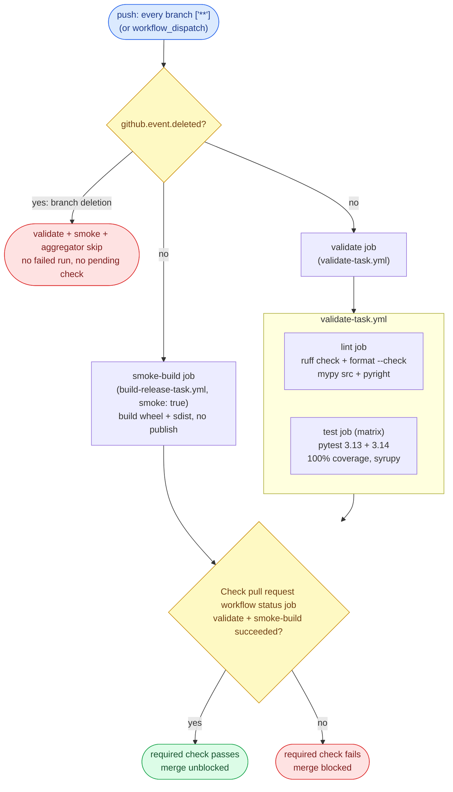
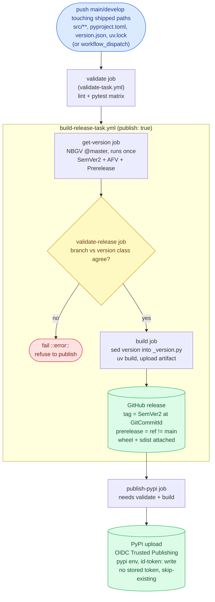
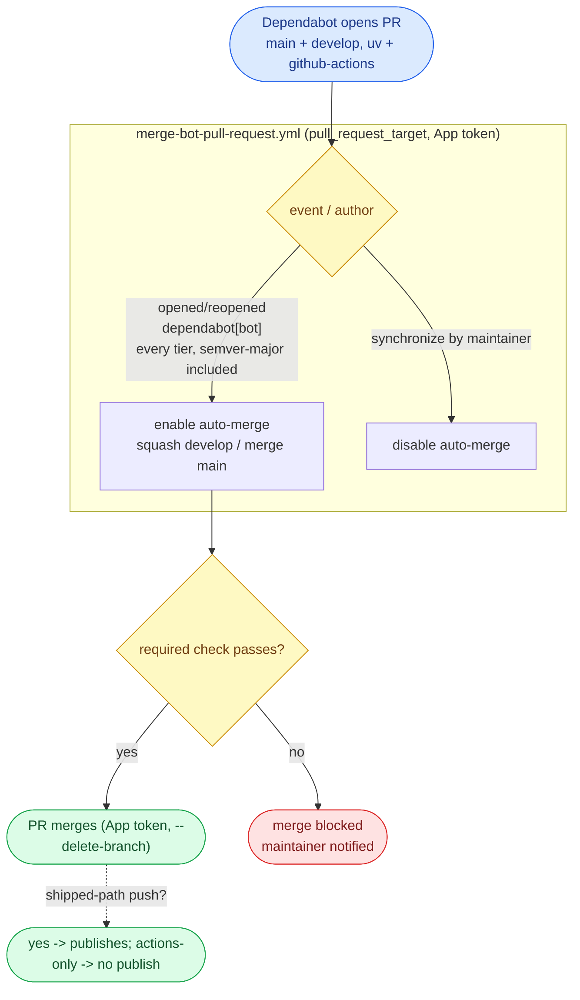

# WORKFLOW.md

The single guide for this repo's CI/CD **workflows** (GitHub Actions): the model, a **behavioral contract** (expected inputs and outputs), and how to verify it. Source style lives in [`CODESTYLE.md`](./CODESTYLE.md), and human-process rules (branching, versioning policy, review etiquette) live in [`GOVERNANCE.md`](./GOVERNANCE.md). This file covers everything under [`.github/workflows/`](./.github/workflows/).

It **describes required outcomes, not a required implementation.** A workflow is correct when it satisfies the contract, whatever shape its YAML takes. Each guarantee names the **failure it prevents**, so the reason survives a reimplementation.

The section numbering and the D-item numbering follow the fleet contract, so a rule elsewhere citing "section 4" or "D9.3" resolves here.

## Adaptation

This repo is a **`uv`-managed Python library** on the **`release`** workflow model with **`releaseTrigger: publish-on-merge`**, shipping **one target**: the PyPI distribution `ptr727-aiopurpleair`. An item of the contract governing a construct this repo does not have is **recorded N/A, not failed**.

- **`publish-on-merge`, not two-phase.** This is the adaptation that matters most, because it inverts the fleet default. A shipped-path push to `main` or `develop` publishes that branch, so **a human merge can and does auto-publish here**. `GOVERNANCE.md` "Release Model" states the two-phase default and this repo is the declared exception, per its registry entry. `OPERATIONS.md` "Review and Merge Preconditions" is the operational form of the same fact.
- **Applicable scenarios:** S1 through S12 in section 5.
- **Recorded N/A** (single target, no Docker, no wrapper, no deploy, no cross-job transfer artifact beyond the build handoff): **D1.1** and **D1.4** (a paths-filter over multiple targets, this repo smoke-builds its one target on every push), **D3.5** (no upstream-version tracker), **D4.6** (no deploy to an owned host), **D5.1** through **D5.3** and **D5.5** through **D5.6** (the one transfer artifact is consumed within its own run under the `retention-days: 1` backstop), **D6.3** and **D6.4** (one target, so no branch-suffix collision surface and no add/drop matrix), **D7.4** (no optional-dependency chaining), **D8.3** (no tracker), and **D9.4** (no Docker layer cache).
- **Default branch is `main`.** The default-branch literals name it identically, and a divergence is a defect: the `prerelease` expression (`!= 'main'`), the PEP 440 `.dev0` branch test, and [`version.json`](./version.json)'s `publicReleaseRefSpec` (`^refs/heads/main$`).
- **NBGV owns the release tag** although nothing is compiled. The .NET SDK is pulled in solely as the versioning toolchain.
- **Recorded drift, with its backstop.** **D2.3** is not satisfied in the YAML: a `workflow_dispatch` carries no fail-fast guard on the trigger ref. The `pypi` deployment environment is restricted to `main` and `develop`, so an out-of-policy dispatch is refused at the environment rather than at entry. The failure is late and loud instead of early and loud, which is a weaker form of the same guarantee.

## 1. Purpose and How to Use This Document

Read section 4 for what the pipeline must do, and section 5 for how to prove it does. Section 3 explains why the pieces are shaped the way they are, and is the section to read before changing one.

### The Model at a Glance

aiopurpleair ships **one target**: the PyPI distribution **`ptr727-aiopurpleair`** (a wheel + sdist), built from the library source in [`src/aiopurpleair/`](./src/aiopurpleair/). PyPI is a **push** distributor - a consumer pins the package and `pip install`s it - so a fresh release should reach PyPI as soon as a shippable change lands, without a manual step for the common case. Two workflows do the work:

- **CI** ([`test-pull-request.yml`](./.github/workflows/test-pull-request.yml)) runs on **push to every branch**: it validates (lint + the 3.13/3.14 pytest matrix) and proves the wheel + sdist build (a smoke build), publishing nothing. A pull request merges only when its one required check is green.
- **The publisher** ([`publish-release.yml`](./.github/workflows/publish-release.yml)) runs on a **paths-filtered push** to `main`/`develop` and on **`workflow_dispatch`**. A push (or dispatch) on `main` cuts a **stable** release (clean PEP 440 `X.Y.Z`); on `develop` a **prerelease** (`X.Y.Z.dev0`). It re-runs the identical validate suite, builds and versions once, cuts a GitHub release, and uploads to PyPI over **OIDC Trusted Publishing** - no stored token.

There is no two-branch matrix: one run builds, versions, and publishes exactly its own trigger ref. Dependabot pull requests merge themselves once their checks pass, on both branches.

### Glossary

- **Entry workflow** - has `push` / `workflow_dispatch` triggers. The orchestrator an event or a person starts.
- **Reusable workflow (task)** - a `workflow_call` workflow invoked through a `uses:` reference, never triggered directly. File ends in `-task.yml`.
- **Target** - the one shipped output: the PyPI wheel + sdist `ptr727-aiopurpleair`, built by [`build-release-task.yml`](./.github/workflows/build-release-task.yml) and uploaded by `publish-release`'s `publish-pypi` job.
- **Validate task** - [`validate-task.yml`](./.github/workflows/validate-task.yml): the `lint` job (`ruff check`, `ruff format --check`, `mypy src`, `pyright`) plus the `test` job (the 3.13/3.14 pytest matrix, 100% coverage, syrupy snapshots, best-effort Codecov upload). CI runs it on every push; the publisher runs the **identical** task before any release.
- **Smoke build** - a `build-release-task` run with `smoke: true`/`publish: false` that builds the wheel + sdist to prove the release pipeline still produces a valid package, uploading and publishing nothing. Its `validate-release` version gate is skipped on smoke.
- **Shipped path** - the paths-filter inclusion list on the publisher's push trigger: `src/aiopurpleair/**`, `pyproject.toml`, `version.json`, `uv.lock`. A push touching one of these to `main`/`develop` publishes; a docs/test/workflow-only push does not.
- **Shipped version** - NBGV's version, computed from `version.json` (SemVer base `1.0`) plus git height. `main` is the public ref (clean `X.Y.Z`); every other branch carries NBGV's `-g{sha}` prerelease segment. The PEP 440 package version is derived from it (`develop` -> `.dev0`) and `sed`-stamped into `_version.py` at build.
- **GitHub App token** - a short-lived installation token from `actions/create-github-app-token`, minted from `CODEGEN_APP_CLIENT_ID` / `CODEGEN_APP_PRIVATE_KEY`. The merge-bot uses it, not `GITHUB_TOKEN`: a `GITHUB_TOKEN` merge does not trigger the downstream publish push, and that token is read-only on Dependabot PRs.

## 2. Workflow Style Conventions

Legibility rules. Necessary but not sufficient: a perfectly styled workflow can still violate section 4.

- **Action pinning.** Pin every action to a commit SHA with a trailing `# vX.Y.Z` comment. The **sole exception is `dotnet/nbgv@master`** (see D6.1): its tag stream lags `master`, so Dependabot tag-tracking would only propose downgrades. The rationale is documented inline in [`get-version-task.yml`](./.github/workflows/get-version-task.yml).
- **Filename.** Reusable workflows end in `-task.yml` and are `uses:`-d, never triggered directly; entry workflows end in what they do (`-pull-request.yml`, `-release.yml`).
- **Names.** Reusable workflow `name:` ends in **"task"**, entry names in **"action"**. Every job `name:` ends in **"job"**, every step `name:` in **"step"** - the aggregator included (`Check pull request workflow status job`). A job name bound as a ruleset required-check `context:` is codified in [`repo-config/`](./repo-config/) and changed only **in lockstep** with the live ruleset.
- **Concurrency.** CI keys on `${{ github.workflow }}-${{ github.ref }}` with `cancel-in-progress: true`. The **publisher** overrides it: a ref-independent group (`group: ${{ github.workflow }}`) with `cancel-in-progress: false`, so a stable and a prerelease publish serialize and none is cancelled mid-release (which could leave a half-created GitHub release or a partial PyPI upload). The **merge-bot** keys on the PR number with `cancel-in-progress: false`.
- **Shells.** Every multi-line bash `run:` starts with `set -euo pipefail`. Multi-line `if:` uses the folded scalar `if: >-`.
- **Boolean inputs.** A boolean used by both `workflow_call` and `workflow_dispatch` is declared in both trigger blocks and compared against `true` and `'true'`.
- **Reusable-workflow permissions.** Job-level `permissions:` are validated before `if:`, so grant least privilege at the callee and let the caller add scope (e.g. `contents: write` for the GitHub release) at the `uses:` job - the read-only smoke caller must not be forced to over-grant.

## 3. Architecture

### Two workflows: CI on push, publishing on push-plus-dispatch

CI ([`test-pull-request.yml`](./.github/workflows/test-pull-request.yml)) and the publisher ([`publish-release.yml`](./.github/workflows/publish-release.yml)) are separate workflows with separate concurrency, so they never race. CI re-tests every pushed tree and never publishes; the publisher releases on a shipped-path push (or a dispatch) to a release branch. *Prevents a CI run from racing a publish on the same ref.*

### The publisher is scoped by branch and by path

A publish happens on a `push` to `main`/`develop` filtered to the shipped paths (`src/aiopurpleair/**`, `pyproject.toml`, `version.json`, `uv.lock`), or on a `workflow_dispatch`. The trigger ref alone decides the version class: `main` -> stable clean SemVer, `develop` -> `.dev0` prerelease. The paths filter is deliberate - a docs, test, or workflow-only push to a release branch does not consume a version. `uv.lock` is in the list because a PyPI version cannot be re-pushed, so a dependency bump must republish to keep the package's declared dependencies current, closing the stale-dependency window. *Prevents both a no-op republish on a docs change and a silently stale dependency set after a lock bump.*

### Validate is one definition, run by both entry points

[`validate-task.yml`](./.github/workflows/validate-task.yml) is the whole quality gate: a `lint` job (`ruff check` + `ruff format --check` + `mypy src` + `pyright`) and a `test` job (the 3.13/3.14 pytest matrix with a 100% coverage gate and syrupy snapshots). CI's `validate` job and the publisher's `validate` job both `uses:` it, and `publish-pypi` `needs:` the publisher's copy. *Keeps the PR gate and the publish gate identical, so nothing publishes that would fail a pull request.*

### Versioning: compute once, thread everywhere

NBGV runs in exactly **one** job ([`get-version-task.yml`](./.github/workflows/get-version-task.yml)), classifying from the checked-out branch (with `IGNORE_GITHUB_REF: "true"` so a dispatch from the default branch does not misclassify), and emits `SemVer2`, `AssemblyFileVersion`, `GitCommitId`, and a derived `Prerelease` flag. `build-release-task` calls it once and every consumer (the version gate, the build, the release) reads its outputs via `needs:`; no job re-invokes NBGV. `main` (the public ref, `publicReleaseRefSpec = ^refs/heads/main$`) builds a clean `X.Y.Z`; every other branch a prerelease. *Keeps the stamped `_version.py`, the wheel version, and the release tag in agreement.* NBGV needs only `version.json` (base `1.0`) and git height, so it works although the repo builds no .NET assembly.

### Build: gate the classification, stamp the version, build the package

[`build-release-task.yml`](./.github/workflows/build-release-task.yml) versions once, then in `validate-release` asserts the branch and version class agree before any build (`main` must have no prerelease `-` segment; every other branch must carry one) - a fail-fast on a misclassification, skipped on smoke. The `build` job checks out the exact `GitCommitId`, computes the PEP 440 version from `SemVer2` with the `-g<sha>` prerelease segment stripped to a clean `X.Y.Z` (`develop` -> `X.Y.Z.dev0`, else `X.Y.Z`; not the 4-part `AssemblyFileVersion`, whose revision component would leak an extra number), `sed`s it into `_version.py` (the placeholder hatchling reads; the rewrite is on the runner only, no commit), and runs `uv build`. On a real publish it uploads the wheel + sdist as a run artifact for `publish-pypi`; the `github-release` job (gated `inputs.publish && !inputs.smoke`) cuts the GitHub release.

### Self-testing workflows, and the required-context invariant

A pull request exercises its own workflow files. CI runs on `push` to every branch (`push: ['**']`), so GitHub head-resolves the reusable `./...` workflows from the pushed head: a PR that edits a reusable task tests its own copy. That push run is the **sole producer** of the aggregator's ruleset-bound `context:`, on the head SHA branch protection evaluates. A branch-deletion push (all-zeros `github.sha`) is skipped by a `!github.event.deleted` guard on both jobs, so a deletion never runs a failing build or leaves the required check pending. **Forks are the documented exception**: a fork cannot push here, so its PR produces no run and a maintainer lands the change on an in-repo branch before merging. There is deliberately **no `pull_request` trigger** - it would create a second producer of the required context.

### The single required check

One aggregator job, `Check pull request workflow status job`, is the ruleset-bound required check and gates the merge. It `needs:` both `validate` and `smoke-build` and fails on any non-success (it must **succeed**, not merely "not fail"). Its name must move only in lockstep with [`repo-config/`](./repo-config/).

### The single-target release

`github-release` (in `build-release-task`, `publish: true`) downloads the build artifact and `softprops/action-gh-release` creates the tag + release with auto-generated notes, attaching the wheel + sdist plus `LICENSE` and `README.md` (`fail_on_unmatched_files: true`). `target_commitish` is set explicitly to the built `GitCommitId` so the tag lands on the built commit, not the API's default branch. The GitHub-release `prerelease` boolean is `github.ref_name != 'main'`. Then `publish-pypi` uploads the same artifact to PyPI over OIDC Trusted Publishing in the `pypi` environment (`id-token: write`, `skip-existing: true`) - no stored key.

### Self-sufficiency: Dependabot on both branches

Dependabot pull requests merge themselves once the required check passes - **every tier, semver-major included**: the required check is the gate, not the version bump. Dependabot is **dual-target** (`main` **and** `develop`) so both branches stay current and never drift apart; a `develop` bump lands as a `.dev0` prerelease republish, a `main` bump as a stable republish (a `uv.lock` bump hits a shipped path, so it publishes; an actions-only bump does not). The [merge-bot](./.github/workflows/merge-bot-pull-request.yml) enables auto-merge on `opened`/`reopened` (squash on `develop`, merge-commit on `main`, by the PR's base ref) and disables it when a maintainer pushes to a bot branch.

### Flow diagrams

Three diagrams trace the architecture above: the pull-request gate, the publisher, and the bot automation. They depict the same outcomes the section 3 contract specifies, drawn from the workflow YAML; if a diagram and a guarantee disagree, one of them is a defect. Triggers are blue, gates yellow, durable/published outputs green, and stop/skip outcomes red.

**Pull request (CI) - `test-pull-request.yml`.** Every push head-resolves the reusable validate task (lint + the 3.13/3.14 pytest matrix) and a smoke build, and a single aggregator produces the ruleset-bound required check (D1, D5).

```mermaid
flowchart TD
    T(["push: every branch ['**']<br/>(or workflow_dispatch)"]):::trig
    T --> D{"github.event.deleted?"}:::gate
    D -- "yes: branch deletion" --> X(["validate + smoke + aggregator skip<br/>no failed run, no pending check"]):::stop
    D -- "no" --> V["validate job<br/>(validate-task.yml)"]
    D -- "no" --> SB["smoke-build job<br/>(build-release-task.yml, smoke: true)<br/>build wheel + sdist, no publish"]
    subgraph VT ["validate-task.yml"]
        LN["lint job<br/>ruff check + format --check<br/>mypy src + pyright"]
        TS["test job (matrix)<br/>pytest 3.13 + 3.14<br/>100% coverage, syrupy"]
    end
    V --> VT
    VT --> A{"Check pull request workflow status job<br/>validate + smoke-build succeeded?"}:::gate
    SB --> A
    A -- "yes" --> G(["required check passes<br/>merge unblocked"]):::pub
    A -- "no" --> R(["required check fails<br/>merge blocked"]):::stop
    classDef trig fill:#dbeafe,stroke:#2563eb,color:#1e3a8a
    classDef gate fill:#fef9c3,stroke:#ca8a04,color:#713f12
    classDef pub fill:#dcfce7,stroke:#16a34a,color:#14532d
    classDef stop fill:#fee2e2,stroke:#dc2626,color:#7f1d1d
```

**Publish - `publish-release.yml` -> `build-release-task.yml`.** A shipped-path push to `main`/`develop`, or a dispatch, runs the same validate suite, versions once, cuts the GitHub release, and uploads to PyPI over OIDC (D2, D3, D4).

```mermaid
flowchart TD
    P(["push main/develop touching shipped paths<br/>src/**, pyproject.toml, version.json, uv.lock<br/>(or workflow_dispatch)"]):::trig --> VAL["validate job<br/>(validate-task.yml)<br/>lint + pytest matrix"]
    VAL --> BUILD
    subgraph BUILD ["build-release-task.yml (publish: true)"]
        GV["get-version job<br/>NBGV @master, runs once<br/>SemVer2 + AFV + Prerelease"] --> VR{"validate-release job<br/>branch vs version class agree?"}:::gate
        VR -- "no" --> VRX(["fail ::error::<br/>refuse to publish"]):::stop
        VR -- "yes" --> BD["build job<br/>sed version into _version.py<br/>uv build, upload artifact"]
        BD --> REL[("GitHub release<br/>tag = SemVer2 at GitCommitId<br/>prerelease = ref != main<br/>wheel + sdist attached")]:::pub
    end
    REL --> PP["publish-pypi job<br/>needs validate + build"]
    PP --> PYPI[("PyPI upload<br/>OIDC Trusted Publishing<br/>pypi env, id-token: write<br/>no stored token, skip-existing")]:::pub
    classDef trig fill:#dbeafe,stroke:#2563eb,color:#1e3a8a
    classDef gate fill:#fef9c3,stroke:#ca8a04,color:#713f12
    classDef pub fill:#dcfce7,stroke:#16a34a,color:#14532d
    classDef stop fill:#fee2e2,stroke:#dc2626,color:#7f1d1d
```

**Automation - Dependabot + merge-bot.** Dependabot opens PRs on both branches; the merge-bot enables auto-merge (or disables it on a maintainer push). A merged shipped-path bump publishes on the resulting push; an actions-only bump does not (D6).

```mermaid
flowchart TD
    DEP(["Dependabot opens PR<br/>main + develop, uv + github-actions"]):::trig --> MB
    subgraph MBT ["merge-bot-pull-request.yml (pull_request_target, App token)"]
        MB{"event / author"}:::gate
        MB -- "opened/reopened<br/>dependabot[bot]<br/>every tier, semver-major included" --> EN["enable auto-merge<br/>squash develop / merge main"]
        MB -- "synchronize by maintainer" --> DIS["disable auto-merge"]
    end
    EN --> CK{"required check passes?"}:::gate
    CK -- "yes" --> MRG(["PR merges (App token, --delete-branch)"]):::pub
    CK -- "no" --> BLK(["merge blocked<br/>maintainer notified"]):::stop
    MRG -. "shipped-path push?" .-> PUB(["yes -> publishes; actions-only -> no publish"]):::pub
    classDef trig fill:#dbeafe,stroke:#2563eb,color:#1e3a8a
    classDef gate fill:#fef9c3,stroke:#ca8a04,color:#713f12
    classDef pub fill:#dcfce7,stroke:#16a34a,color:#14532d
    classDef stop fill:#fee2e2,stroke:#dc2626,color:#7f1d1d
```

## 4. Behavioral Contract: Expected Outcomes

The required behaviors, organized by domain. Each is a **MUST**, and its `Output:` states what a conforming pipeline is required to hold. A workflow that violates any **applicable** guarantee is **not operational**. Items recorded N/A for this repo are listed in "Adaptation" above and are not restated here.

### D1 - PR Fast-Feedback (Smoke)

- **D1.2 A validation job always runs.** Input: any push, on any branch. Output: `test-pull-request` calls `validate-task` and a `smoke-build`, with no paths filter, and the aggregator `needs:` both. `validate-task`'s `lint` job runs `ruff check`, `ruff format --check`, `mypy src` (strict, shipped surface) and `pyright` (src + tests, strict on src). Its `test` job runs the 3.13/3.14 pytest matrix with the 100% coverage gate and syrupy snapshots, `fail-fast: false` so both interpreters report. All of these read the same `pyproject.toml` config the editor uses, so a style or typing defect cannot reach the branch on editor-faith. The one exception is a **branch-deletion push**: a `!github.event.deleted` guard skips both jobs and the aggregator, because `github.sha` is all-zeros and a checkout would fail. *Prevents: a PR merging with no validation, a reusable-workflow or build break shipping untested, and a deletion push reddening CI.*
- **D1.3 Smoke never publishes and never uploads.** Input: `smoke: true` / `publish: false`. Output: `build-release-task` builds the wheel and sdist to prove the release path still produces a valid package, and the artifact upload and both publish jobs are guarded off. *Prevents: a CI run publishing, and orphaned artifacts churning the storage quota.*
- **D1.5 One required aggregator gates merge.** Input: any PR. Output: a single aggregator job, `Check pull request workflow status job`, must **succeed**. It runs under `if: ${{ always() && !github.event.deleted }}` so a failed or skipped dependency cannot skip the gate itself, `needs:` `validate` and `smoke-build`, and blocks on `failure` and `cancelled`. It is the sole producer of the ruleset-bound `context:`, with no `pull_request` fallback. Its job `name:` and the ruleset `context:` in [`repo-config/`](./repo-config/) are the same string and are renamed **only** in lockstep. A fork cannot push, so a fork PR is validated by maintainer action, the one exception. *Prevents: a dual-producer context race, and a defect merging unverified.*
- **D1.6 Coverage is reported to Codecov.** Output: the `test` job runs pytest under coverage and a `codecov/codecov-action` step uploads the report **best-effort** (`continue-on-error`, `fail_ci_if_error: false`), so a Codecov outage or an absent token never reds the gate. [`codecov.yml`](./codecov.yml) carries this repo's own threshold, which is deliberately stricter than the fleet's report-only default. *Prevents: coverage silently going unreported, and a Codecov outage blocking an unrelated pull request.*

### D2 - Input/State Validation at Entry

- **D2.1 Validate before expensive work.** Output: `build-release-task`'s `validate-release` job asserts the branch and version class agree before any build, and the `build` job `needs:` it. *Prevents: spending a build on a tree that is already misclassified.*
- **D2.2 Release branch matches version classification.** Input: a real (non-smoke) release build. Output: the gate fails loudly if `main` carries a prerelease `-` segment, or a non-`main` branch carries none. On a smoke build the **check exits early while the job still reports success**, because a detached PR head always versions as prerelease. *Prevents: a `develop` build published as stable, and the gate blocking every promotion PR.*
- **D2.3 Publish only from `main` or `develop`.** **Recorded drift.** Output today: no entry-level guard rejects a dispatch from another ref. The `pypi` deployment environment is restricted to `main` and `develop`, so the publish is refused there instead. See "Adaptation" above. *Prevents, where satisfied: cutting a release from an unintended branch.*

### D3 - Versioning and Classification

- **D3.1 One branch per run, versioned once.** Output: the run versions, builds, and tags exactly `github.ref_name`, driven into `build-release-task` as the `branch` input. There is no matrix and no `branch` input that can disagree with the ref. NBGV runs in exactly **one** job, `get-version-task`, with `IGNORE_GITHUB_REF: "true"` so a dispatch from the default branch does not misclassify, and emits `SemVer2`, `AssemblyFileVersion`, `GitCommitId` and a derived `Prerelease` flag. Every consumer reads those through `needs:`, and no job re-invokes NBGV. *Prevents: publishing a branch other than the one that triggered, and the stamped version diverging from the tag.*
- **D3.2 Default = public, others = prerelease.** Output: `main` produces a clean `X.Y.Z` under `publicReleaseRefSpec = ^refs/heads/main$`, and every other branch produces `X.Y.Z-g<sha>`. The default-branch literal in the gate, the `prerelease` expression, and `version.json` all name `main`.
- **D3.3 Version floor + git height.** Output: [`version.json`](./version.json) sets the major.minor floor, currently `1.0`, and NBGV appends the git height as the patch, never bumped on a cadence. NBGV and `version.json` are retained although this repo compiles nothing, because they own the tag. *(Who raises the floor and when is a human-process rule in `GOVERNANCE.md` "Release Model", with this repo's own facts in `OPERATIONS.md` "Release and Versioning Facts".)*
- **D3.4 Registry versions follow the classification.** Output: the PEP 440 package version is derived from `SemVer2` with the `-g<sha>` prerelease segment stripped to a clean `X.Y.Z`, and `.dev0` appended on `develop` only, a two-branch literal rather than a generic rule. `AssemblyFileVersion` is deliberately not used, its revision component would leak an extra number. The version is `sed`-stamped into [`_version.py`](./src/aiopurpleair/_version.py) on the runner after the frozen `uv sync`, then `uv build` produces the wheel and sdist. **No version is committed to git.** The `develop` `.dev0` build stays `pip install --pre`-selectable and sorts above the `main` release, the git height keeping develop ahead. *Prevents: a develop leg published as a release, and a dirty tree.*

### D4 - Release / Publish

- **D4.1 Gated single-branch publish.** Output: PRs smoke-test and publish nothing. `publish-release` triggers are a `push` to `main` or `develop` filtered to the shipped paths (`src/aiopurpleair/**`, `pyproject.toml`, `version.json`, `uv.lock`), plus `workflow_dispatch`. The trigger ref alone decides the version class. A docs, test, or workflow-only push does not publish. `uv.lock` is in the list because a PyPI version cannot be re-pushed, so a dependency bump must republish to keep the declared dependency set current. **Unlike the fleet default, a human merge to a release branch does publish here**, per "Adaptation". *Prevents: a no-op republish on a non-shipping change, and a silently stale dependency set after a lock bump.*
- **D4.2 Tag the built commit.** Output: the `build` and `github-release` jobs check out `needs.get-version.outputs.GitCommitId`, and the release `target_commitish` is that SHA rather than a branch name, so the package, the tag, and the bundled files all match the commit NBGV versioned even if the branch advances mid-run. The `prerelease` boolean is `github.ref_name != 'main'`. *Prevents: a race between versioning and building, and a develop release's tag landing on main's tip.*
- **D4.3 Release contents.** Output: every release is a tag on the built commit plus auto-generated notes, with the wheel and sdist, `LICENSE`, and `README.md` attached under `fail_on_unmatched_files: true`. *Prevents: a release missing its artifact.*
- **D4.4 No-op republish, and keyless upload.** Output: `publish-pypi` runs in the `pypi` environment with `permissions: id-token: write` and uploads via `pypa/gh-action-pypi-publish` over **OIDC Trusted Publishing**, under `skip-existing: true`, so the server dedupes a version that already exists rather than failing the run. There is **no** stored PyPI token, and the Trusted Publisher registration plus the environment's branch restriction is the whole trust chain. *Prevents: a leaked publish credential, since there is none to leak, and a hard failure on a re-run of an unchanged version.*
- **D4.5 A build failure blocks every publish target.** Output: `publish-pypi` `needs:` the publisher's `validate` job, which is the identical `validate-task` that CI runs, so a regressed tip fails validation and never uploads. The push itself is what no gate can cover: it runs after the release job, so a rejected token exchange or a trusted-publishing policy naming the wrong workflow file leaves a published release and tag for a version that never reached PyPI. The recovery is a re-dispatch or a full re-run rather than a cleanup. *Prevents: publishing a tree that would fail the PR gate.*

### D5 - Resource Cleanup

- **D5.4 Retention backstop.** Output: the one `upload-artifact`, the `aiopurpleair-build-<branch>` handoff from `build` to `publish-pypi`, sets `retention-days: 1`. Every other D5 item is recorded N/A per "Adaptation": the artifact is consumed inside its own run, so there is no cross-run accumulation for a delete step to prevent.

### D6 - Seam / Architecture Conformance

- **D6.1 CI and the publisher are separate, and each builds one branch.** Output: `test-pull-request` and `publish-release` are separate workflows with separate concurrency, so they never race. CI validates exactly `github.ref_name` and publishes nothing, and the publisher versions, builds, and tags exactly its own trigger ref. The `build` to `publish-pypi` handoff is by artifact `name:`, not `artifact-ids:`. *Prevents: cross-branch ref mixing, and a CI run racing a publish on the same ref.*
- **D6.2 Branch drives config.** Output: `build-release-task` reads `inputs.branch` for every branch-derived decision rather than `github.ref_name`, so a task called with an explicit branch behaves the same however it was reached.

### D7 - Concurrency, Permissions, Safety

- **D7.1 Publisher serializes.** Output: the publisher uses a **global, ref-independent** concurrency group (`group: ${{ github.workflow }}`) with `cancel-in-progress: false`, so a stable and a prerelease publish serialize and neither is cancelled mid-release. CI keys on `${{ github.workflow }}-${{ github.ref }}` with `cancel-in-progress: true`, and the merge-bot keys on the PR number with `cancel-in-progress: false`. *Prevents: a double push, and a cancelled publish leaving a half-created release or a partial upload.*
- **D7.2 A called job's permissions block is validated before its `if:`.** Output: reusable jobs grant least privilege at the callee, and the caller adds scope at the `uses:` job, `contents: write` for the GitHub release and `id-token: write` for the OIDC upload. *Prevents: a `startup_failure` on the read-only smoke caller, which must not be forced to over-grant.*
- **D7.3 A `github.event.inputs` boolean is compared as a string.** Output: this repo's booleans (`smoke`, `publish`) arrive only by `workflow_call`, where the `inputs` context preserves the declared boolean, so they are read directly as `inputs.smoke` and `inputs.publish` rather than compared against `'true'`. A boolean that later gains a `workflow_dispatch` path is declared in both trigger blocks and compared against `'true'` on that path, since that context delivers every input as a string.

### D8 - Bots / Automation

- **D8.1 Merge-bot.** Output: runs on `pull_request_target` with the App token, merges the PR by URL without checking out its code, and passes `--delete-branch`. It enables auto-merge on `opened` and `reopened`, dispatching `--squash` on `develop` and `--merge` on `main` by the PR's base ref, and disables it when a maintainer pushes to a bot branch (`synchronize`, actor not the bot). Concurrency is keyed on the **PR number**. It uses the App token rather than `GITHUB_TOKEN`, because a `GITHUB_TOKEN` merge does not trigger the downstream publish push and that token is read-only on Dependabot PRs. *Prevents: two PRs colliding in auto-merge, and a bot merge that silently fails to publish.*
- **D8.2 Dependabot auto-merges every tier, on both branches.** Output: every Dependabot PR auto-merges once the required check passes, **semver-major included**, because the required checks are the gate rather than the bump magnitude. [`.github/dependabot.yml`](./.github/dependabot.yml) targets **both** `main` and `develop`, each ecosystem listed once per branch. A merged shipped-path bump publishes on the resulting push, and an Actions-only bump does not. *Prevents: a safe update stalling on a human, and cross-branch drift.*
- **D8.4 An identity allowlist used as a gate fails loud.** Output: the merge-bot's failure is self-announcing, since bot PRs visibly pile up unmerged, so an annotation on the non-matching branch is optional here rather than required.

### D9 - Style / Static

`GOVERNANCE.md` "Workflow YAML Conventions" names the tool D9.1 excepts and states the suffix rules D9.2 requires.

- **D9.1** Every action is SHA-pinned with a trailing version comment. The **sole exception is `dotnet/nbgv@master`**, whose tag stream lags `master` so tag-tracking would only propose downgrades, and the rationale is documented inline in [`get-version-task.yml`](./.github/workflows/get-version-task.yml).
- **D9.2** File, workflow, job, and step names follow the suffix rules in section 2. The ruleset-bound aggregator's `name:` equals its ruleset `context:`, renamed together.
- **D9.3** Bash `run:` blocks start `set -Eeuo pipefail`. Multi-line `if:` uses the folded scalar `if: >-`.
- **D9.5** Line endings follow [`.editorconfig`](./.editorconfig): workflow YAML is LF, because Dependabot and Actions rewrite it with LF.

## 5. Test Methodology

Evaluate every job's `if:` and `needs:` against the scenario's inputs, statically from the YAML, and compare the predicted run/skip plus version plus release against the expected column. No execution is required.

| # | Input | Expected output | Exercises |
| --- | --- | --- | --- |
| S1 | push touching `src/aiopurpleair/**` on a feature branch | `validate` runs the full suite and `smoke-build` builds the package, **no publish**, aggregator success | D1.2, D1.3, D6.1 |
| S2 | push changing only docs on a feature branch | `validate` and `smoke-build` run, nothing publishes, aggregator success | D1.2 |
| S3 | push changing only `.github/workflows/**` | the changed reusable workflow is exercised head-resolved (self-test), aggregator success | D1.2, D1.5 |
| S4 | shipped-path push to `main` | `validate` passes, `build` cuts a **stable** `X.Y.Z` GitHub release at the built SHA, and `publish-pypi` uploads over OIDC | D3.2, D4.1, D4.2, D4.4 |
| S5 | shipped-path push to `develop` | publishes a **prerelease** `X.Y.Z.dev0` with `prerelease=true`, tagged at the develop SHA | D3.4, D4.1, D4.2 |
| S6 | docs-only push to `main` | the paths filter excludes it, so **nothing publishes** | D4.1 |
| S7 | `workflow_dispatch` on `main` | force-publishes the current `main` tip as a stable release | D4.1, D4.2 |
| S8 | PR with a ruff, mypy, pyright, or pytest failure | `validate` reds, so the aggregator blocks the merge | D1.2, D1.5 |
| S9 | a branch is **deleted** (push, all-zeros SHA) | the `!github.event.deleted` guard skips both CI jobs and the aggregator, so no failed run and no pending required check | D1.2, D1.5 |
| S10 | Dependabot semver-major `uv` bump merged to `develop` | the merge-bot auto-merges on green, and the `uv.lock` change is a shipped path, so it republishes `.dev0` | D8.1, D8.2, D4.1 |
| S11 | Dependabot github-actions bump merged | the merge-bot auto-merges, and a workflow-only path, so **no publish** | D8.2, D4.1 |
| S12 | a `main` version carrying a stray prerelease `-` segment | `validate-release` fails with `::error::`, so nothing publishes | D2.1, D2.2 |
| S13 | re-dispatch of an unchanged version | the GitHub release is refreshed on the same tag with no duplicate, and the PyPI upload is a server-side no-op under `skip-existing` | D4.4 |

## 6. Configuration and Verification

The workflows depend on configuration outside the YAML, and a misconfiguration surfaces only as a failed run, so it is part of "operational".

**Secrets.**

- `CODECOV_TOKEN` - the Codecov upload token the pytest matrix uses. Optional (the upload is `continue-on-error`, `fail_ci_if_error: false`), Actions store only.
- `CODEGEN_APP_CLIENT_ID` / `CODEGEN_APP_PRIVATE_KEY` - the GitHub App credentials the merge-bot mints its token from. Required in **both** the Actions and Dependabot secret stores: a Dependabot-triggered run reads the Dependabot store, not Actions secrets. The App must be installed on the repo with `contents: write` and `pull-requests: write`.
- **No PyPI API token.** Publishing is OIDC Trusted Publishing - register this repo + `publish-release.yml` as a pending/trusted publisher on PyPI and create a `pypi` deployment environment restricted to `main` and `develop`.

**Branch rulesets.** `main` - merge-commit only; requires the aggregator status check; signed commits; strict-status **off**; **no** linear-history rule (so the `develop -> main` promotion merge-commit is allowed). `develop` - squash merges only (linear history); the same required check; signed commits; strict **off**. The required check's `context:` matches the aggregator job name verbatim.

**Repository settings.** Auto-merge enabled; squash and merge-commit both allowed (each ruleset narrows its branch to one); rebase off; auto-delete-on-merge **off** (so a promotion does not delete `develop`; the merge-bot deletes bot heads explicitly with `--delete-branch`). Dependabot version **and** security updates enabled.

**Validation.** This configuration is codified in [`repo-config/`](./repo-config/) and applied/audited by `repo-config/configure.sh`; `check` **is** the 5D configuration audit. Secret values cannot be read back, so the audit asserts the names exist; the App installation and the PyPI publisher registration are manual/best-effort items.
